# Hidden Markov Models

## Caso Bolsa


```python
import numpy as np
import pandas as pd
import matplotlib.pyplot as plt
import argparse
import logging
import sys

import torch
import torch.nn as nn
from torch.distributions import constraints

import numpy as np
import tensorflow as tf
#tf.enable_v2_behavior()
import tensorflow_probability as tfp
from tensorflow_probability import distributions as tfd

from matplotlib import pylab as plt
%matplotlib inline
import scipy.stats as stats
import scipy.special as special
```


```python
from google.colab import drive
drive.mount('/content/drive')
```

    Mounted at /content/drive
    

Leemos el excel de las bolsas


```python
data = pd.read_excel("/content/drive/MyDrive/TFG informatica/GDP.xlsx");
data["Date"] = [int(tiempo) + (tiempo-int(tiempo))*2.5 for tiempo in data["Date"]]
data.index = data.Date
#data["GDP_LCHANGE"] = data["GDP"].diff()
data["Change"][0] = 0
data.head(5)
```

    <ipython-input-5-81e5c08478b1>:5: SettingWithCopyWarning: 
    A value is trying to be set on a copy of a slice from a DataFrame
    
    See the caveats in the documentation: https://pandas.pydata.org/pandas-docs/stable/user_guide/indexing.html#returning-a-view-versus-a-copy
      data["Change"][0] = 0
    <ipython-input-5-81e5c08478b1>:5: FutureWarning: Treating integers as positional in Series.__setitem__ with a Float64Index is deprecated. In a future version, `series[an_int] = val` will insert a new key into the Series. Use `series.iloc[an_int] = val` to treat the key as positional.
      data["Change"][0] = 0
    


  <div id="df-b4c84932-c59a-416b-bdce-df6142a65dbb">
    <div class="colab-df-container">
      <div>
<style scoped>
    .dataframe tbody tr th:only-of-type {
        vertical-align: middle;
    }

    .dataframe tbody tr th {
        vertical-align: top;
    }

    .dataframe thead th {
        text-align: right;
    }
</style>
<table border="1" class="dataframe">
  <thead>
    <tr style="text-align: right;">
      <th></th>
      <th>Date</th>
      <th>GDP</th>
      <th>Change</th>
      <th>NBER</th>
    </tr>
    <tr>
      <th>Date</th>
      <th></th>
      <th></th>
      <th></th>
      <th></th>
    </tr>
  </thead>
  <tbody>
    <tr>
      <th>1947.25</th>
      <td>1947.25</td>
      <td>2034.450</td>
      <td>0.000000</td>
      <td>0</td>
    </tr>
    <tr>
      <th>1947.50</th>
      <td>1947.50</td>
      <td>2029.024</td>
      <td>-0.267062</td>
      <td>0</td>
    </tr>
    <tr>
      <th>1947.75</th>
      <td>1947.75</td>
      <td>2024.834</td>
      <td>-0.206717</td>
      <td>0</td>
    </tr>
    <tr>
      <th>1948.00</th>
      <td>1948.00</td>
      <td>2056.508</td>
      <td>1.552168</td>
      <td>0</td>
    </tr>
    <tr>
      <th>1948.25</th>
      <td>1948.25</td>
      <td>2087.442</td>
      <td>1.492999</td>
      <td>0</td>
    </tr>
  </tbody>
</table>
</div>
      <button class="colab-df-convert" onclick="convertToInteractive('df-b4c84932-c59a-416b-bdce-df6142a65dbb')"
              title="Convert this dataframe to an interactive table."
              style="display:none;">

  <svg xmlns="http://www.w3.org/2000/svg" height="24px"viewBox="0 0 24 24"
       width="24px">
    <path d="M0 0h24v24H0V0z" fill="none"/>
    <path d="M18.56 5.44l.94 2.06.94-2.06 2.06-.94-2.06-.94-.94-2.06-.94 2.06-2.06.94zm-11 1L8.5 8.5l.94-2.06 2.06-.94-2.06-.94L8.5 2.5l-.94 2.06-2.06.94zm10 10l.94 2.06.94-2.06 2.06-.94-2.06-.94-.94-2.06-.94 2.06-2.06.94z"/><path d="M17.41 7.96l-1.37-1.37c-.4-.4-.92-.59-1.43-.59-.52 0-1.04.2-1.43.59L10.3 9.45l-7.72 7.72c-.78.78-.78 2.05 0 2.83L4 21.41c.39.39.9.59 1.41.59.51 0 1.02-.2 1.41-.59l7.78-7.78 2.81-2.81c.8-.78.8-2.07 0-2.86zM5.41 20L4 18.59l7.72-7.72 1.47 1.35L5.41 20z"/>
  </svg>
      </button>

  <style>
    .colab-df-container {
      display:flex;
      flex-wrap:wrap;
      gap: 12px;
    }

    .colab-df-convert {
      background-color: #E8F0FE;
      border: none;
      border-radius: 50%;
      cursor: pointer;
      display: none;
      fill: #1967D2;
      height: 32px;
      padding: 0 0 0 0;
      width: 32px;
    }

    .colab-df-convert:hover {
      background-color: #E2EBFA;
      box-shadow: 0px 1px 2px rgba(60, 64, 67, 0.3), 0px 1px 3px 1px rgba(60, 64, 67, 0.15);
      fill: #174EA6;
    }

    [theme=dark] .colab-df-convert {
      background-color: #3B4455;
      fill: #D2E3FC;
    }

    [theme=dark] .colab-df-convert:hover {
      background-color: #434B5C;
      box-shadow: 0px 1px 3px 1px rgba(0, 0, 0, 0.15);
      filter: drop-shadow(0px 1px 2px rgba(0, 0, 0, 0.3));
      fill: #FFFFFF;
    }
  </style>

      <script>
        const buttonEl =
          document.querySelector('#df-b4c84932-c59a-416b-bdce-df6142a65dbb button.colab-df-convert');
        buttonEl.style.display =
          google.colab.kernel.accessAllowed ? 'block' : 'none';

        async function convertToInteractive(key) {
          const element = document.querySelector('#df-b4c84932-c59a-416b-bdce-df6142a65dbb');
          const dataTable =
            await google.colab.kernel.invokeFunction('convertToInteractive',
                                                     [key], {});
          if (!dataTable) return;

          const docLinkHtml = 'Like what you see? Visit the ' +
            '<a target="_blank" href=https://colab.research.google.com/notebooks/data_table.ipynb>data table notebook</a>'
            + ' to learn more about interactive tables.';
          element.innerHTML = '';
          dataTable['output_type'] = 'display_data';
          await google.colab.output.renderOutput(dataTable, element);
          const docLink = document.createElement('div');
          docLink.innerHTML = docLinkHtml;
          element.appendChild(docLink);
        }
      </script>
    </div>
  </div>


## Análisis exploratorio

Vamos a ver dos gráficos, de la evolución en los precios y la variación entre ellos:


```python
plt.figure(figsize = (10,5))
plt.plot(data["Date"], data["GDP"])
plt.xlabel("Time")
plt.ylabel("US GDP (B)")
plt.grid(True)
plt.show()
```


    
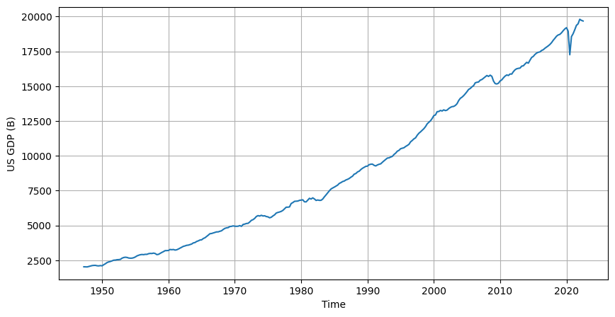
    


```python
plt.figure(figsize = (10,5))
plt.plot(data["Date"], data["Change"])
plt.xlabel("Time")
plt.ylabel("US GDP Change")
plt.grid(True)
plt.show()
```


    
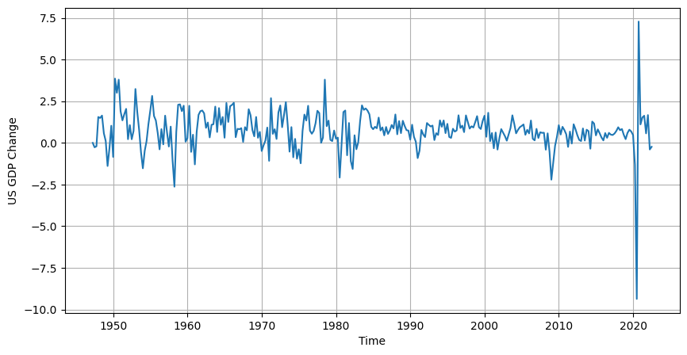
    


Hay un periodo de alta volatilidad en 2020. Como se trata de un aprendizaje supervisado, veamos qué periodos se consideran como de recesión.


```python
plt.figure(figsize = (20, 10))
plt.plot(data["Date"], data["Change"], color="blue")
plt.plot(np.where(data["NBER"]==1, data["Date"], np.nan),
         np.where(data["NBER"]==1, data["Change"], np.nan), color="red")
plt.xlabel("Time")
plt.ylabel("US GDP Change")
plt.grid(True)
plt.show()
```


    
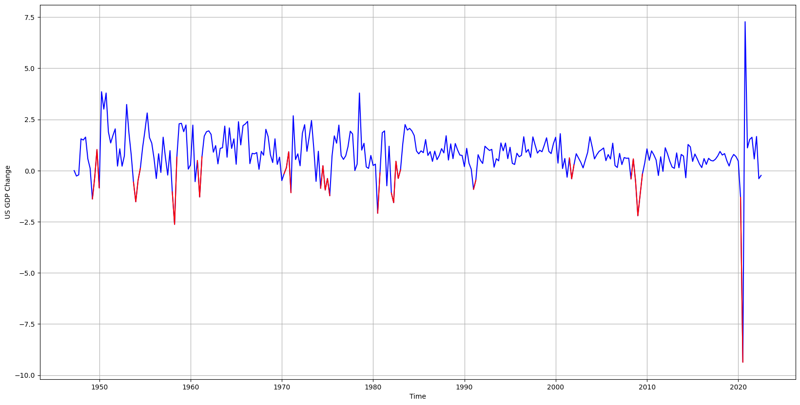
    


Vamos a ver cómo se distribuyen las variables


```python
# Intentamos ajustar los datos con una normal
mu, std = stats.norm.fit(data["Change"])
x = np.linspace(data["Change"].min(), data["Change"].max(), 100)
pdf = stats.norm.pdf(x, mu, std)

plt.hist(data["Change"], bins=50, density=True)
plt.plot(x, pdf)
plt.xlabel("Change")
plt.ylabel("Density")
plt.title("Density Function of Change")
plt.show()
```


    
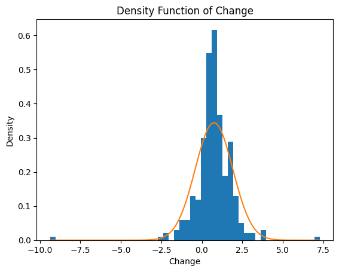
    


La idea será encontrar las dos medias de las dos distribuciones normales para poder crear un modelo de mixtura que capte los dos estados con mejor precisión


```python
data["Change"].loc[data["NBER"]==0]
```


    0      0.000000
    1     -0.267062
    2     -0.206717
    3      1.552168
    4      1.492999
             ...   
    297    1.627432
    298    0.569324
    299    1.666809
    300   -0.396477
    301   -0.234643
    Name: Change, Length: 259, dtype: float64


```python
# Intentamos ajustar los datos con una normal
mu, std = stats.norm.fit(data["Change"].loc[data["NBER"]==0])
mu2, std2 = stats.norm.fit(data["Change"].loc[data["NBER"]==1])
x = np.linspace(data["Change"].min(), data["Change"].max(), len(data["Change"]))
pdf = stats.norm.pdf(x, mu, std)
pdf2 = stats.norm.pdf(x, mu2, std2)

plt.hist(data["Change"], bins=50, density=True)
plt.plot(x, pdf)
plt.plot(x, pdf2)
plt.xlabel("Change")
plt.ylabel("Density")
plt.title("Density Function of Change")
plt.show()
```


    
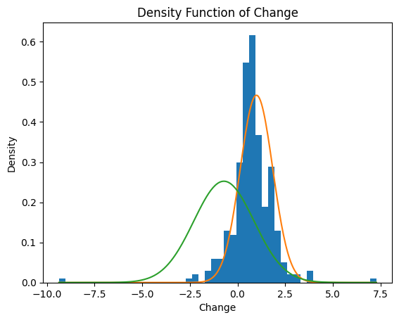
    


```python
# Intentamos ajustar los datos con una normal
import matplotlib.pyplot as plt
plt.figure(figsize = (30, 10))
plt.subplot(1,2,1)
datos = data["Change"].loc[data["NBER"]==0]
mu, std = stats.norm.fit(datos)
x = np.linspace(data["Change"].min(), data["Change"].max(), len(data["Change"]))
pdf = stats.norm.pdf(x, mu, std)

plt.hist(datos, bins=50, density=True)
plt.plot(x, pdf)
plt.xlabel("Change con NBER = 0")
plt.ylabel("Density")
plt.title("Density Function of Change")
x_point = 0.8
pdf_point = stats.norm.pdf(x_point, mu, std)
hist, bin_edges = np.histogram(datos, bins=50, density=True)
hist_point = hist[np.searchsorted(bin_edges, x_point, side='right')-1]
# Dibuja un punto rojo en el punto deseado en la función de densidad
plt.scatter(x_point, pdf_point, color='orange', s=50, zorder=3)
plt.annotate(f'({x_point:.2f}, {pdf_point:.2f})', (x_point, pdf_point), xytext=(10, 10), textcoords='offset points', ha='left', va='bottom')
# Dibuja un punto rojo en el punto deseado en el histograma
plt.scatter(x_point, hist_point, color='orange', s=50, zorder=3)
plt.annotate(f'({x_point:.2f}, {hist_point:.2f})', (x_point, hist_point), xytext=(10, 0), textcoords='offset points', ha='left', va='top')
plt.plot([x_point, x_point], [pdf_point, hist_point], color='orange', linestyle='--', linewidth=1)

plt.subplot(1,2,2)
datos2 = data["Change"].loc[data["NBER"]==1]
mu2, std2 = stats.norm.fit(datos2)
x2 = np.linspace(data["Change"].min(), data["Change"].max(), len(data["Change"]))
pdf2 = stats.norm.pdf(x2, mu2, std2)

plt.hist(datos2, bins=50, density=True)
plt.plot(x2, pdf2, color="limegreen")
plt.xlabel("Change con NBER = 1")
plt.ylabel("Density")
plt.title("Density Function of Change")
x_point2 = -0.25
pdf_point2 = stats.norm.pdf(x_point2, mu2, std2)
hist2, bin_edges2 = np.histogram(datos2, bins=50, density=True)
hist_point2 = hist2[np.searchsorted(bin_edges2, x_point2, side='right')-1]
# Dibuja un punto rojo en el punto deseado en la función de densidad
plt.scatter(x_point2, pdf_point2, color='limegreen', s=50, zorder=3)
plt.annotate(f'({x_point2:.2f}, {pdf_point2:.2f})', (x_point2, pdf_point2), xytext=(10, 10), textcoords='offset points', ha='left', va='bottom')
# Dibuja un punto rojo en el punto deseado en el histograma
plt.scatter(x_point2, hist_point2, color='limegreen', s=50, zorder=3)
plt.annotate(f'({x_point2:.2f}, {hist_point2:.2f})', (x_point2, hist_point2), xytext=(10, 0), textcoords='offset points', ha='left', va='top')
plt.plot([x_point2, x_point2], [pdf_point2, hist_point2], color='limegreen', linestyle='--', linewidth=1)

plt.show()
```


    
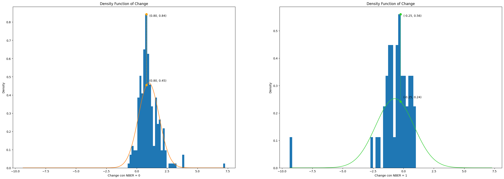
    


```python
from scipy.stats import kstest

mu, std = stats.norm.fit(data["Change"].loc[data["NBER"]==0])
print("KSTest (NBER = 0):", kstest(data["Change"].loc[data["NBER"]==0], stats.norm.cdf(x, mu, std)))
mu, std = stats.norm.fit(data["Change"].loc[data["NBER"]==1])
print("KSTest (NBER = 1):", kstest(data["Change"].loc[data["NBER"]==1], stats.norm.cdf(x, mu, std)))

```

    KSTest (NBER = 0): KstestResult(statistic=0.4790713135083996, pvalue=1.6290603683426422e-29, statistic_location=0.09388324015880606, statistic_sign=-1)
    KSTest (NBER = 1): KstestResult(statistic=0.6976744186046512, pvalue=1.7945884348739528e-18, statistic_location=-0.11891779649300105, statistic_sign=1)
    

## Modelo Oculto de Markov


```python
train = data
test = data
```

### Caso Naive (mismo conjunto de datos para entrenamiento y prueba)

En primer lugar hay una versión guiada de un primer acercamiento usando los mismos datos de entrenamiento y de test, posteriormente encapsularemos en funciones la creación y optimización del HMM y usaremos un sistema de validación cruzada progresiva.

El primer caso intenta usar la variable `data["NBER"]` para estimar los parámetros $\lambda = \{A, B, \pi\}$ del modelo oculto de Markov.


```python
nber_1 = (train["NBER"] == 1).sum()
nber_0 = (train["NBER"] == 0).sum()

# P(nber = 1 | 0)  y P(nber = 0| 1)
cond_0 = ((train['NBER'] == 1) & (train['NBER'].shift() == 0)).sum()
cond_1 = ((train['NBER'] == 0) & (train['NBER'].shift() == 1)).sum()

#Llamemos Pij a la probabilidad de ir del estado i al j, entonces la matriz de transición es:
p01 = cond_0/nber_0
p00 = 1 - p01
p10 = cond_1/nber_1
p11 = 1 - p10
```


```python
#Tenemos 2 estados, recesión o no recesión
num_states = 2
batch_size = 1

#Vamos a iniciar con las proporciones de transición acorde a los datos
proporcion_rec = (train["NBER"] == 1).sum() /len(train["NBER"])

# Inicializamos las probabilidades iniciales 
initial_state_probs = tf.Variable([1 - proporcion_rec, proporcion_rec], dtype=tf.float32)
# Suma 1
initial_state_probs = initial_state_probs / tf.reduce_sum(initial_state_probs)

# Creamos la matriz de transición
transition_probs = tf.Variable([[p00,p01],[p10,p11]], dtype=tf.float32)
# Suma 1
transition_probs = transition_probs / tf.reduce_sum(transition_probs, axis=1, keepdims=True)


# Inicializamos las probabilidades de emisión
# Supongamos que los cambios se modelan como una distribución Normal
media_recesion = train.loc[train["NBER"] == 1, "Change"].mean()
media_no_recesion = train.loc[train["NBER"] == 0, "Change"].mean()
std_recesion = train.loc[train["NBER"] == 1, "Change"].std(ddof=0)
std_no_recesion = train.loc[train["NBER"] == 0, "Change"].std(ddof=0)

starting_loc =  tf.Variable([media_no_recesion, media_recesion], shape = (2,), dtype=tf.float32, name = "medias")
starting_scale = tf.Variable([ std_no_recesion, std_recesion], shape = (2,), dtype=tf.float32, name = "varianzas")
observation_distribution = tfd.Normal(loc= starting_loc, scale=starting_scale)
```


```python
print(initial_state_probs)
print(transition_probs)
print(starting_loc)
print(starting_scale)
```

    tf.Tensor([0.8576159  0.14238411], shape=(2,), dtype=float32)
    tf.Tensor(
    [[0.95366794 0.04633205]
     [0.27906978 0.7209302 ]], shape=(2, 2), dtype=float32)
    <tf.Variable 'medias:0' shape=(2,) dtype=float32, numpy=array([ 0.99490494, -0.7147465 ], dtype=float32)>
    <tf.Variable 'varianzas:0' shape=(2,) dtype=float32, numpy=array([0.8546541, 1.5801374], dtype=float32)>
    


```python
# Create the HiddenMarkovModel object
hmm = tfp.distributions.HiddenMarkovModel(
    initial_distribution=tfd.Categorical(probs=initial_state_probs),
    transition_distribution=tfd.Categorical(probs=transition_probs),
    observation_distribution=observation_distribution,
    num_steps=len(train),
    validate_args=True
)

```

Ahora podemos realizar predicciones con este modelo, empecemos por predecir todos los datos con los que hemos generado el modelo:


```python
posterior_dists = hmm.posterior_marginals(test["Change"].astype(np.float32))
posterior_probs = posterior_dists.probs_parameter().numpy()
predicted_results  = hmm.posterior_mode(test["Change"].astype(np.float32)).numpy() 
print(predicted_results)
print(np.array(test["NBER"]))
most_probable_rates = tf.gather(starting_loc, predicted_results )
```

    [0 0 0 0 0 0 0 1 1 1 1 1 0 0 0 0 0 0 0 0 0 0 0 0 0 0 1 1 1 1 0 0 0 0 0 0 0
     0 0 0 0 0 0 1 1 0 0 0 0 0 0 0 0 1 1 1 0 0 0 0 0 0 0 0 0 0 0 0 0 0 0 0 0 0
     0 0 0 0 0 0 0 0 0 0 0 0 0 0 0 0 0 0 0 0 0 0 0 0 0 0]
    [0 0 0 0 0 0 0 0 1 1 1 1 0 0 0 0 0 0 0 0 0 0 0 0 0 0 1 1 1 1 0 0 0 0 0 0 0
     0 0 0 0 0 0 1 1 1 0 0 0 0 0 0 0 0 1 1 1 0 0 0 0 0 0 0 0 0 0 0 0 0 0 0 0 0
     0 0 0 0 0 0 0 0 0 0 0 0 0 0 0 0 0 0 1 1 1 1 0 0 0 0]
    

Veámos visualmente el error que hemos cometido:


```python
plt.figure(figsize = (20, 10))
plt.plot(test["Date"], test["Change"], color="blue")
plt.plot(np.where(np.equal(predicted_results , test["NBER"]), test["Date"], np.nan),
         np.where(np.equal(predicted_results , test["NBER"]), test["Change"], np.nan), color="blue")
plt.plot(np.where((predicted_results==0) & (test["NBER"]==1), test["Date"], np.nan),
         np.where((predicted_results==0) & (test["NBER"]==1), test["Change"], np.nan), color="red")
plt.plot(np.where((predicted_results==1) & (test["NBER"]==0), test["Date"], np.nan),
         np.where((predicted_results==1) & (test["NBER"]==0), test["Change"], np.nan), color="k")
plt.plot(np.where((predicted_results==1) & (test["NBER"]==1), test["Date"], np.nan),
         np.where((predicted_results==1) & (test["NBER"]==1), test["Change"], np.nan), color="m")
plt.xlabel("Time")
plt.ylabel("US GDP Change")
plt.grid(True)
plt.show()
```


    
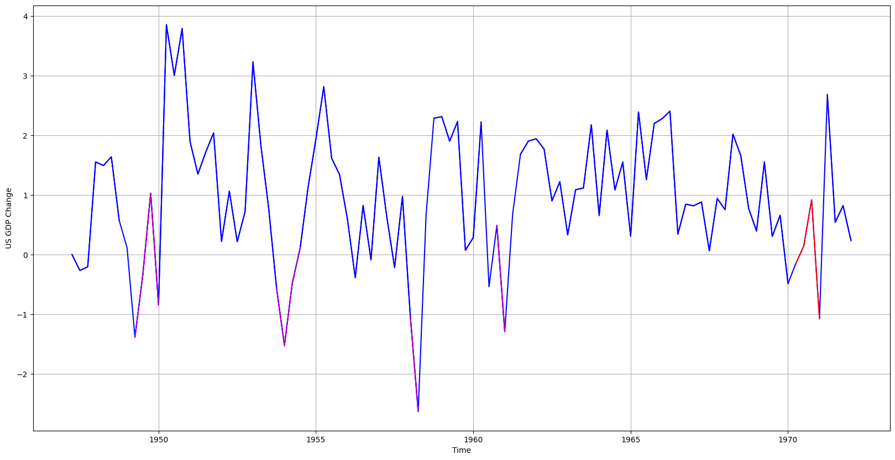
    


Ahora vamos a evaluar el modelo respecto a los datos.


```python
def compute_Fbeta_score(true_values, predicted_results, beta = 1):
  true_values = test["NBER"]

  # Calculate number of true positives, false positives, true negatives, and false negatives
  true_positives = np.sum(np.logical_and(predicted_results == 1, true_values == 1))
  false_positives = np.sum(np.logical_and(predicted_results == 1, true_values == 0))
  true_negatives = np.sum(np.logical_and(predicted_results == 0, true_values == 0))
  false_negatives = np.sum(np.logical_and(predicted_results == 0, true_values == 1))

  # Calculate accuracy, false positive rate, and false negative rate
  accuracy = (true_positives + true_negatives) / len(true_values)
  false_positive_rate = false_positives / (false_positives + true_negatives)
  false_negative_rate = false_negatives / (false_negatives + true_positives)

  # Calculate precision and recall
  precision = true_positives / (true_positives + false_positives)
  recall = true_positives / (true_positives + false_negatives)

  # Calculate Fbeta score
  if precision + recall > 0:
      fbeta_score = (1+beta**2) * (precision * recall) / ((beta**2) * precision + recall)
  else:
      fbeta_score = 0

  return fbeta_score
```


```python
print("F1-score:",compute_Fbeta_score(test["NBER"],predicted_results))
print("F2-score:",compute_Fbeta_score(test["NBER"],predicted_results,beta=2))
```

Existe una serie de variables del HMM que pueden ser entrenadas:


```python
hmm.trainable_variables
```


    (<tf.Variable 'medias:0' shape=(2,) dtype=float32, numpy=array([ 0.99490494, -0.7147465 ], dtype=float32)>,
     <tf.Variable 'varianzas:0' shape=(2,) dtype=float32, numpy=array([0.8546541, 1.5801374], dtype=float32)>)


#### Optimización con log-verosimilitud

Vamos a entrenar ahora el HMM usando un optimizador Adam y veamos el resultado:


```python
# Distribuciones a priori no informativas
prior_loc = tfd.Normal(loc=0., scale=5.)
prior_scale = tfd.HalfNormal(scale=5.)
#https://github.com/stan-dev/stan/wiki/Prior-Choice-Recommendations

def negative_log_likelihood():
  log_prob = hmm.log_prob(train["Change"])
  log_prob += tf.reduce_sum(prior_loc.log_prob(observation_distribution.loc))
  log_prob += tf.reduce_sum(prior_scale.log_prob(observation_distribution.scale))
  return -log_prob


losses = tfp.math.minimize(
    lambda: negative_log_likelihood(),
    optimizer=tf.optimizers.Adam(learning_rate=0.1),
    num_steps=100)

plt.plot(losses)
plt.xlabel("Iteración")
plt.ylabel("log-verosimilitud")
plt.show()
```


    
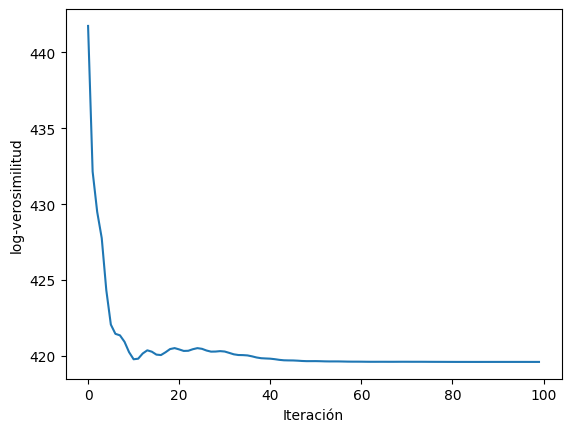
    


```python
hmm.trainable_variables
```


    (<tf.Variable 'medias:0' shape=(2,) dtype=float32, numpy=array([0.8259794 , 0.36189362], dtype=float32)>,
     <tf.Variable 'varianzas:0' shape=(2,) dtype=float32, numpy=array([0.6894928, 2.3618324], dtype=float32)>)


```python
predicted_results  = hmm.posterior_mode(test["Change"].astype(np.float32)).numpy() 
print("F1-score:",compute_Fbeta_score(test["NBER"],predicted_results))
print("F2-score:",compute_Fbeta_score(test["NBER"],predicted_results,beta=2))
```

    F1-score: 0.5897435897435898
    F2-score: 0.5555555555555556
    


```python
# Gráfico del modelo de mixtura con las dos nuevas distribuciones
mu, std = hmm.trainable_variables[0][0].numpy(), hmm.trainable_variables[1][0].numpy()
mu2, std2 = hmm.trainable_variables[0][1].numpy(), hmm.trainable_variables[1][1].numpy()
x = np.linspace(data["Change"].min(), data["Change"].max(), len(data["Change"]))
pdf = stats.norm.pdf(x, mu, std)
pdf2 = stats.norm.pdf(x, mu2, std2)

plt.hist(data["Change"], bins=50, density=True)
plt.plot(x, pdf)
plt.plot(x, pdf2)
plt.xlabel("Change")
plt.ylabel("Density")
plt.title("Density Function of Change")
plt.show()
```


    
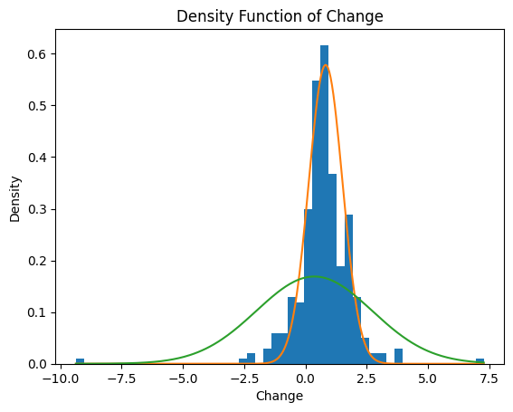
    


#### Optimización con binary cross-entropy


```python

"""
BCE = 0
for y, prob in zip(test["NBER"],posterior_probs):
  BCE +=y*np.log(prob[1])+(1-y)*np.log((1-prob[1]))
BCE = -BCE / len(posterior_probs)
"""
def compute_bce():
  posterior_dists = hmm.posterior_marginals(test["Change"].astype(np.float32))
  posterior_probs = posterior_dists.probs_parameter()
  bce = tf.losses.BinaryCrossentropy()
  return bce(test["NBER"],posterior_probs[:,1])


losses = tfp.math.minimize(
    lambda: compute_bce(),
    optimizer=tf.optimizers.Adam(learning_rate=0.1),
    num_steps=30)
plt.plot(losses)
plt.xlabel("Iteración")
plt.ylabel("BCE")
plt.show()
```


    
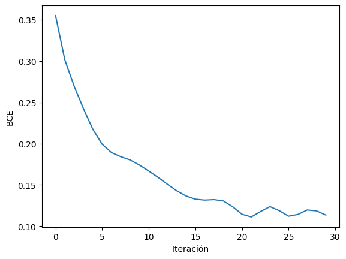
    


```python
hmm.trainable_variables
```


    (<tf.Variable 'medias:0' shape=(2,) dtype=float32, numpy=array([ 1.8265238, -1.5253026], dtype=float32)>,
     <tf.Variable 'varianzas:0' shape=(2,) dtype=float32, numpy=array([0.90131986, 0.97276413], dtype=float32)>)


```python
predicted_results  = hmm.posterior_mode(test["Change"].astype(np.float32)).numpy() 
print("F1-score:",compute_Fbeta_score(test["NBER"],predicted_results))
print("F2-score:",compute_Fbeta_score(test["NBER"],predicted_results,beta=2))
```

    F1-score: 0.8444444444444444
    F2-score: 0.8675799086757989
    


```python
# Gráfico del modelo de mixtura con las dos nuevas distribuciones
mu, std = hmm.trainable_variables[0][0].numpy(), hmm.trainable_variables[1][0].numpy()
mu2, std2 = hmm.trainable_variables[0][1].numpy(), hmm.trainable_variables[1][1].numpy()
x = np.linspace(data["Change"].min(), data["Change"].max(), len(data["Change"]))
pdf = stats.norm.pdf(x, mu, std)
pdf2 = stats.norm.pdf(x, mu2, std2)

plt.hist(data["Change"], bins=50, density=True)
plt.plot(x, pdf)
plt.plot(x, pdf2)
plt.xlabel("Change")
plt.ylabel("Density")
plt.title("Density Function of Change")
plt.show()
```


    
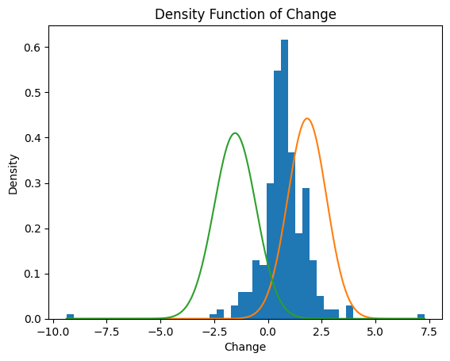
    


### Caso Naive Tensorflow

Ahora vamos a dividir el conjunto de datos principal en dos subconjuntos, uno para entrenamiento y otro para pruebas. Antes de hacer la división es necesario encapsular el procedimiento anterior en funciones:


```python
def naive_HMM_setup(train, y_train):
  nber_1 = (y_train == 1).sum()
  nber_0 = (y_train == 0).sum()

  # P(nber = 1 | 0)  y P(nber = 0| 1)
  cond_0 = ((y_train == 1) & (np.roll(y_train, -1) == 0)).sum()
  cond_1 = ((y_train == 0) & (np.roll(y_train, -1) == 1)).sum()

  #Llamemos Pij a la probabilidad de ir del estado i al j, entonces la matriz de transición es:
  p01 = cond_0/nber_0
  p00 = 1 - p01
  p10 = cond_1/nber_1
  p11 = 1 - p10

  #Tenemos 2 estados, recesión o no recesión
  num_states = 2
  batch_size = 1

  #Vamos a iniciar con las proporciones de transición acorde a los datos
  proporcion_rec = (y_train == 1).sum() /len(y_train)

  # Inicializamos las probabilidades iniciales 
  initial_state_probs = tf.Variable([1 - proporcion_rec, proporcion_rec], dtype=tf.float32)
  # Suma 1
  initial_state_probs = initial_state_probs / tf.reduce_sum(initial_state_probs)

  # Creamos la matriz de transición
  transition_probs = tf.Variable([[p00,p01],[p10,p11]], dtype=tf.float32)
  # Suma 1
  transition_probs = transition_probs / tf.reduce_sum(transition_probs, axis=1, keepdims=True)


  # Inicializamos las probabilidades de emisión
  # Supongamos que los cambios se modelan como una distribución Normal
  media_recesion = np.mean(train[:,1][y_train == 1])
  media_no_recesion = np.mean(train[:,1][y_train == 0])
  std_recesion = np.std(train[:,1][y_train == 1])
  std_no_recesion = np.std(train[:,1][y_train == 0])

  starting_loc =  tf.Variable([media_no_recesion, media_recesion], shape = (2,), dtype=tf.float32, name = "medias")
  starting_scale = tf.Variable([ std_no_recesion, std_recesion], shape = (2,), dtype=tf.float32, name = "varianzas")
  observation_distribution = tfd.Normal(loc= starting_loc, scale=starting_scale)
  print(initial_state_probs)
  print(transition_probs)
  print(starting_loc)
  print(starting_scale)

  # HiddenMarkovModel
  hmm = tfp.distributions.HiddenMarkovModel(
      initial_distribution=tfd.Categorical(probs=initial_state_probs),
      transition_distribution=tfd.Categorical(probs=transition_probs),
      observation_distribution=observation_distribution,
      num_steps=len(train),
      validate_args=True
  )
  return hmm

```


```python
from sklearn.model_selection import TimeSeriesSplit
tscv = TimeSeriesSplit()
X = data[["Date","Change"]].to_numpy()
y = data["NBER"].to_numpy()
for i, (train_index, test_index) in enumerate(tscv.split(X,y)):
  #print('TRAIN:', train_index, 'TEST:', test_index)
  train, test = X[train_index], X[test_index]
  y_train, y_test = y[train_index], y[test_index]
  # Obtenemos el hmm
  hmm = naive_HMM_setup(train,y_train)
  #calculamos para este primer HMM las F-scores
  predicted_results  = hmm.posterior_mode(test[:,1].astype(np.float32)).numpy() 
  print("F1-score (i):",compute_Fbeta_score(y_test,predicted_results))
  print("F2-score (i):",compute_Fbeta_score(y_test,predicted_results,beta=2))

```

### Caso Baum-Welch

Para comenzar vamos a iniciar el algoritmo partiendo desde los parámetros que usamos en el enfoque anterior, no obstante, como hemos visto en la teoría hay varias advertencias a las que tenemos que prestar atención. Por ejemplo, recordemos que la función de verosimilitud tiene varios máximos locales y por ello ejecutaremos el algoritmo con varias condiciones iniciales.


```python
def create_HMM(initial_state_matrix,transition_matrix,distributions,train):
    initial_state_probs = tf.Variable(initial_state_matrix, dtype=tf.float32)
    # Suma 1
    initial_state_probs = initial_state_probs / tf.reduce_sum(initial_state_probs)

    # Creamos la matriz de transición
    transition_probs = tf.Variable(transition_matrix, dtype=tf.float32)
    # Suma 1
    transition_probs = transition_probs / tf.reduce_sum(transition_probs, axis=1, keepdims=True)

    starting_loc = tf.Variable([distribution.loc for distribution in distributions], shape=(2,), dtype=tf.float32,
                               name="medias")
    starting_scale = tf.Variable([distribution.scale for distribution in distributions], shape=(2,), dtype=tf.float32,
                                 name="varianzas")
    observation_distribution = tfd.Normal(loc=starting_loc, scale=starting_scale)
    # HiddenMarkovModel
    hmm = tfp.distributions.HiddenMarkovModel(
        initial_distribution=tfd.Categorical(probs=initial_state_probs),
        transition_distribution=tfd.Categorical(probs=transition_probs),
        observation_distribution=observation_distribution,
        num_steps=len(train),
        validate_args=True
    )
    return hmm
```


```python
nber_1 = (train["NBER"] == 1).sum()
nber_0 = (train["NBER"] == 0).sum()

# P(nber = 1 | 0)  y P(nber = 0| 1)
cond_0 = ((train['NBER'] == 1) & (train['NBER'].shift() == 0)).sum()
cond_1 = ((train['NBER'] == 0) & (train['NBER'].shift() == 1)).sum()

#Llamemos Pij a la probabilidad de ir del estado i al j, entonces la matriz de transición es:
p01 = cond_0/nber_0
p00 = 1 - p01
p10 = cond_1/nber_1
p11 = 1 - p10
#Tenemos 2 estados, recesión o no recesión
num_states = 2
batch_size = 1

#Vamos a iniciar con las proporciones de transición acorde a los datos
proporcion_rec = (train["NBER"] == 1).sum() /len(train["NBER"])

# Inicializamos las probabilidades iniciales 
initial_state_matrix = np.array([1 - proporcion_rec, proporcion_rec])
# Creamos la matriz de transición
transition_matrix = np.array([[p00,p01],[p10,p11]])

# Inicializamos las probabilidades de emisión
# Supongamos que los cambios se modelan como una distribución Normal
media_recesion = train.loc[train["NBER"] == 1, "Change"].mean()
media_no_recesion = train.loc[train["NBER"] == 0, "Change"].mean()
std_recesion = train.loc[train["NBER"] == 1, "Change"].std(ddof=0)
std_no_recesion = train.loc[train["NBER"] == 0, "Change"].std(ddof=0)

prior_1= tfd.Normal(loc=media_no_recesion, scale=std_no_recesion)
prior_2= tfd.Normal(loc=media_recesion, scale=std_recesion)
n_states = 2
n_obs = len(train["Change"])
hmm=create_HMM(initial_state_matrix,transition_matrix,[prior_1,prior_2],train)
```

Ahora vamos a calcular las probabilidades forward y backward:


```python

def forward_probabilities(initial_state_matrix, transition_matrix, distributions, observations):
    # number of states & observations
    n_states = len(initial_state_matrix)
    n_obs = len(observations)
    alpha = np.zeros((n_states, n_obs))
    scale = np.zeros(n_obs)
    # Calculate the initial forward probabilities
    matrix = np.array([distributions[0].prob(observations.iat[0]), distributions[1].prob(observations.iat[0])])
    res = np.multiply(initial_state_matrix, matrix)
    alpha[:, 0] = res
    scale[0] = sum(alpha[:, 0])
    alpha[:, 0] = alpha[:, 0] / scale[0]
    # Compute the forward probabilities recursively
    for i in range(1, n_obs):
        for j in range(n_states):
            # alpha[t] = np.matmul(np.matmul(alpha[t-1], transition_matrix) , matrix)
            alpha_aux = [alpha[k, i - 1] * distributions[j].prob(observations.iat[i]) * transition_matrix[k, j] for k in
                         range(n_states)]
            alpha[j, i] = sum(alpha_aux)
            scale[i] += alpha[j, i]
        alpha[:, i] = [alpha[k, i] / scale[i] for k in range(n_states)]

    lik = sum(alpha[:, -1])
    return alpha, scale, lik


def backward_probabilities(scale, initial_state_matrix, transition_matrix, distributions, observations):
    # number of states & observations
    n_states = len(initial_state_matrix)
    n_obs = len(observations)
    beta = np.zeros((n_states, n_obs))
    # Calculate the initial backward probabilities
    beta[:, -1] = np.divide([1, 1], scale[-1])
    # Compute the backward probabilities recursively
    for i in range(2, n_obs + 1):
        for j in range(n_states):
            beta_aux = [beta[k, -i + 1] * distributions[k].prob(observations.iat[-i + 1]) * transition_matrix[j, k] for
                        k in range(n_states)]
            beta[j, -i] = sum(beta_aux)
        beta[:, -i] = np.divide(beta[:, -i], scale[-i])

    start_state = [beta[k, 0] * distributions[k].prob(observations.iat[0]) for k in range(n_states)]
    start_state = np.multiply(start_state, initial_state_matrix)
    start_state_val = sum(start_state)
    return beta, start_state_val

```


```python
alf,scale, lik_alpha  = forward_probabilities(initial_state_matrix, transition_matrix, [prior_1,prior_2], train["Change"])
beta,lik_beta  = backward_probabilities(scale, initial_state_matrix, transition_matrix, [prior_1,prior_2], train["Change"])
print("alpha:", alf[:,:5], "lik:",lik_alpha)
print("beta:", beta[:,:5], "lik:",lik_beta)
log_verosim = - np.sum(np.log(scale))
print("log-verosimilitud:", log_verosim)
```

    alpha: [[0.86234833 0.80004536 0.76601935 0.94221378 0.97796929]
     [0.13765167 0.19995464 0.23398065 0.05778622 0.02203071]] lik: 1.0
    beta: [[4.23678776 6.36179922 6.32917354 3.25052294 2.73969307]
     [4.27204911 4.16675414 2.29478451 1.28813594 1.59610085]] lik: 1.0000000000000027
    log-verosimilitud: 432.927700723136
    

También podemos obtener la verosimilitud del modelo oculto de Markov construido usando la librería de `Tensorflow`


```python
hmm.log_prob(train["Change"]).numpy()
```


    -432.92932


Ahora calculemos las probabilidades $\xi$ y $\gamma$


```python
# Probabilidad de transitar de un estado j a k en un tiempo t
def xi_probabilities(forward, backward, transition_matrix, distributions, observations):
    n_states = forward.shape[0]
    n_observations = forward.shape[1]
    xi = np.zeros((n_states, n_observations - 1, n_states))

    for t in range(n_observations - 1):
        for j in range(n_states):
            for k in range(n_states):
                xi[j, t, k] = (forward[j, t] * backward[k, t + 1] * transition_matrix[j, k]
                               * distributions[k].prob(observations.iat[t + 1]))
    return xi


# Probabilidad de estar en el estado i en un tiempo t
def gamma_probabilities(xi):
    n_states = xi.shape[0]
    gamma = np.zeros((n_states, xi.shape[1]))

    for t in range(xi.shape[1]):
        for j in range(n_states):
            gamma[j, t] = sum(xi[j, t, :])

    return gamma
```


```python
xi = xi_probabilities(alf,beta, transition_matrix, [prior_1,prior_2], train["Change"])
gamma = gamma_probabilities(xi)
print("gamma:", gamma[:,:5])
print("xi:",xi[:,0,:])

```

    gamma: [[0.86136153 0.85933187 0.90029438 0.97627237 0.98704614]
     [0.13863847 0.14066813 0.09970562 0.02372763 0.01295386]]
    xi: [[0.82098334 0.04037819]
     [0.03834853 0.10028994]]
    

Igualmente lo podemos comparar con `TensorflowProbability`


```python
new_gammas = hmm.posterior_marginals(train["Change"].astype(np.float32)).probs_parameter().numpy()
print([new_gammas[t_x,: ] for t_x in range(len(train["Change"]) - 1)])
```

    [array([0.861356 , 0.1386439], dtype=float32), array([0.85932463, 0.14067529], dtype=float32), array([0.9002917, 0.0997083], dtype=float32), array([0.9762716 , 0.02372832], dtype=float32), array([0.98704565, 0.01295438], dtype=float32), array([0.9746829 , 0.02531704], dtype=float32), array([0.8900078 , 0.10999225], dtype=float32), array([0.63846195, 0.36153796], dtype=float32), array([0.22125076, 0.77874917], dtype=float32), array([0.32707697, 0.6729231 ], dtype=float32), array([0.47436482, 0.5256351 ], dtype=float32), array([0.38677788, 0.613222  ], dtype=float32), array([0.50006866, 0.49993134], dtype=float32), array([0.72765505, 0.27234498], dtype=float32), array([0.80085266, 0.19914733], dtype=float32), array([0.96025527, 0.03974469], dtype=float32), array([0.9882826 , 0.01171726], dtype=float32), array([0.9934316 , 0.00656843], dtype=float32), array([0.9924589 , 0.00754107], dtype=float32), array([0.9836269 , 0.01637302], dtype=float32), array([0.9880559 , 0.01194416], dtype=float32), array([0.97892594, 0.02107414], dtype=float32), array([0.9797707 , 0.02022927], dtype=float32), array([0.9641023 , 0.03589759], dtype=float32), array([0.9519541 , 0.04804597], dtype=float32), array([0.82325286, 0.17674707], dtype=float32), array([0.33785862, 0.6621414 ], dtype=float32), array([0.11763864, 0.88236135], dtype=float32), array([0.32538658, 0.6746135 ], dtype=float32), array([0.70240885, 0.29759112], dtype=float32), array([0.93461186, 0.06538817], dtype=float32), array([0.98219496, 0.01780492], dtype=float32), array([0.9874569 , 0.01254304], dtype=float32), array([0.99297863, 0.00702136], dtype=float32), array([0.9910129 , 0.00898706], dtype=float32), array([0.9764695 , 0.02353048], dtype=float32), array([0.94198185, 0.05801807], dtype=float32), array([0.9674669 , 0.03253302], dtype=float32), array([0.95629996, 0.04369999], dtype=float32), array([0.9705563 , 0.02944363], dtype=float32), array([0.9270234 , 0.07297663], dtype=float32), array([0.7817474 , 0.21825252], dtype=float32), array([0.66944104, 0.33055902], dtype=float32), array([0.08846281, 0.9115372 ], dtype=float32), array([0.00253782, 0.9974621 ], dtype=float32), array([0.7237246, 0.2762754], dtype=float32), array([0.9382143, 0.0617857], dtype=float32), array([0.9820887 , 0.01791144], dtype=float32), array([0.99119186, 0.0088081 ], dtype=float32), array([0.9877684 , 0.01223169], dtype=float32), array([0.9650193 , 0.03498068], dtype=float32), array([0.954413  , 0.04558702], dtype=float32), array([0.93246675, 0.06753324], dtype=float32), array([0.7699733, 0.2300267], dtype=float32), array([0.73692155, 0.26307842], dtype=float32), array([0.55980897, 0.44019097], dtype=float32), array([0.87919545, 0.12080462], dtype=float32), array([0.9748219 , 0.02517809], dtype=float32), array([0.991356  , 0.00864392], dtype=float32), array([0.99421144, 0.00578844], dtype=float32), array([0.9945314 , 0.00546861], dtype=float32), array([0.9927722 , 0.00722773], dtype=float32), array([0.99254996, 0.00745003], dtype=float32), array([0.9869051 , 0.01309482], dtype=float32), array([0.9922063 , 0.00779367], dtype=float32), array([0.99339503, 0.00660497], dtype=float32), array([0.9935245, 0.0064755], dtype=float32), array([0.9912374 , 0.00876266], dtype=float32), array([0.99376535, 0.00623464], dtype=float32), array([0.9935502 , 0.00644983], dtype=float32), array([0.9933183, 0.0066817], dtype=float32), array([0.9867771 , 0.01322282], dtype=float32), array([0.9919623 , 0.00803762], dtype=float32), array([0.9938377 , 0.00616226], dtype=float32), array([0.99395764, 0.00604251], dtype=float32), array([0.9934075 , 0.00659257], dtype=float32), array([0.9916487 , 0.00835134], dtype=float32), array([0.9860732 , 0.01392676], dtype=float32), array([0.98996407, 0.01003598], dtype=float32), array([0.99029785, 0.00970202], dtype=float32), array([0.9886028 , 0.01139724], dtype=float32), array([0.9789874 , 0.02101252], dtype=float32), array([0.98920286, 0.01079724], dtype=float32), array([0.99097013, 0.00902983], dtype=float32), array([0.9939464, 0.0060537], dtype=float32), array([0.99407977, 0.00592022], dtype=float32), array([0.9903957 , 0.00960429], dtype=float32), array([0.9859389 , 0.01406109], dtype=float32), array([0.98840183, 0.01159806], dtype=float32), array([0.96950877, 0.03049122], dtype=float32), array([0.94524795, 0.05475203], dtype=float32), array([0.8534095 , 0.14659047], dtype=float32), array([0.85468394, 0.14531614], dtype=float32), array([0.8768586 , 0.12314137], dtype=float32), array([0.87707597, 0.12292406], dtype=float32), array([0.74197793, 0.25802207], dtype=float32), array([0.91821474, 0.0817852 ], dtype=float32), array([0.96507275, 0.03492714], dtype=float32), array([0.9822116 , 0.01778839], dtype=float32), array([0.98190135, 0.01809867], dtype=float32), array([0.99247235, 0.0075276 ], dtype=float32), array([0.9934244, 0.0065756], dtype=float32), array([0.9927049 , 0.00729504], dtype=float32), array([0.9924475, 0.0075525], dtype=float32), array([0.98242307, 0.01757688], dtype=float32), array([0.9437232 , 0.05627685], dtype=float32), array([0.7574132, 0.2425867], dtype=float32), array([0.7055505 , 0.29444948], dtype=float32), array([0.34533983, 0.6546602 ], dtype=float32), array([0.30273882, 0.6972611 ], dtype=float32), array([0.1311593, 0.8688407], dtype=float32), array([0.14122218, 0.85877776], dtype=float32), array([0.16298695, 0.837013  ], dtype=float32), array([0.7821949 , 0.21780507], dtype=float32), array([0.9572891 , 0.04271097], dtype=float32), array([0.98726547, 0.0127346 ], dtype=float32), array([0.9919109 , 0.00808913], dtype=float32), array([0.9900981 , 0.00990195], dtype=float32), array([0.9884054 , 0.01159456], dtype=float32), array([0.9903826 , 0.00961736], dtype=float32), array([0.9932623 , 0.00673763], dtype=float32), array([0.9936774, 0.0063226], dtype=float32), array([0.9895753 , 0.01042467], dtype=float32), array([0.9643361 , 0.03566385], dtype=float32), array([0.9571128 , 0.04288725], dtype=float32), array([0.9376171 , 0.06238277], dtype=float32), array([0.9787285 , 0.02127146], dtype=float32), array([0.9846692 , 0.01533075], dtype=float32), array([0.9632813, 0.0367187], dtype=float32), array([0.94322026, 0.05677978], dtype=float32), array([0.923773  , 0.07622697], dtype=float32), array([0.81153136, 0.18846864], dtype=float32), array([0.58490115, 0.4150989 ], dtype=float32), array([0.06237563, 0.9376243 ], dtype=float32), array([0.42974347, 0.5702566 ], dtype=float32), array([0.7487658, 0.2512341], dtype=float32), array([0.75964916, 0.24035089], dtype=float32), array([0.5094594, 0.4905407], dtype=float32), array([0.48599607, 0.5140039 ], dtype=float32), array([0.08897354, 0.9110265 ], dtype=float32), array([0.05060704, 0.9493929 ], dtype=float32), array([0.45821235, 0.5417877 ], dtype=float32), array([0.58446383, 0.41553608], dtype=float32), array([0.80110073, 0.19889921], dtype=float32), array([0.95788145, 0.0421185 ], dtype=float32), array([0.9869696, 0.0130303], dtype=float32), array([0.9933752 , 0.00662483], dtype=float32), array([0.99442613, 0.00557384], dtype=float32), array([0.9947785 , 0.00522155], dtype=float32), array([0.99467534, 0.00532464], dtype=float32), array([0.9929655 , 0.00703457], dtype=float32), array([0.9919467 , 0.00805321], dtype=float32), array([0.99251294, 0.00748713], dtype=float32), array([0.99249953, 0.00750052], dtype=float32), array([0.99388915, 0.00611089], dtype=float32), array([0.991332  , 0.00866801], dtype=float32), array([0.99111295, 0.00888705], dtype=float32), array([0.987602  , 0.01239798], dtype=float32), array([0.99055785, 0.00944223], dtype=float32), array([0.98840714, 0.01159281], dtype=float32), array([0.99037564, 0.00962434], dtype=float32), array([0.9926386 , 0.00736142], dtype=float32), array([0.9924119 , 0.00758803], dtype=float32), array([0.9936884 , 0.00631149], dtype=float32), array([0.9897776 , 0.01022232], dtype=float32), array([0.9928396 , 0.00716037], dtype=float32), array([0.9903747 , 0.00962521], dtype=float32), array([0.9934179 , 0.00658219], dtype=float32), array([0.99251443, 0.00748554], dtype=float32), array([0.9899683 , 0.01003174], dtype=float32), array([0.986261  , 0.01373901], dtype=float32), array([0.9747859 , 0.02521407], dtype=float32), array([0.97152674, 0.02847315], dtype=float32), array([0.9172934, 0.0827066], dtype=float32), array([0.79778826, 0.20221171], dtype=float32), array([0.6226243 , 0.37737575], dtype=float32), array([0.7042364 , 0.29576358], dtype=float32), array([0.9078958, 0.0921043], dtype=float32), array([0.9581674 , 0.04183255], dtype=float32), array([0.97555363, 0.02444637], dtype=float32), array([0.99024415, 0.00975583], dtype=float32), array([0.9926122 , 0.00738778], dtype=float32), array([0.99231297, 0.00768703], dtype=float32), array([0.9904758 , 0.00952421], dtype=float32), array([0.98070353, 0.01929653], dtype=float32), array([0.98509586, 0.01490412], dtype=float32), array([0.9868969 , 0.01310311], dtype=float32), array([0.99291694, 0.00708312], dtype=float32), array([0.99293154, 0.00706854], dtype=float32), array([0.9934518 , 0.00654815], dtype=float32), array([0.98986644, 0.01013347], dtype=float32), array([0.9909478 , 0.00905225], dtype=float32), array([0.9835743, 0.0164257], dtype=float32), array([0.98227596, 0.01772398], dtype=float32), array([0.98889804, 0.01110194], dtype=float32), array([0.98952836, 0.01047168], dtype=float32), array([0.9910097 , 0.00899032], dtype=float32), array([0.99394184, 0.00605811], dtype=float32), array([0.9926302, 0.0073699], dtype=float32), array([0.9926595 , 0.00734049], dtype=float32), array([0.99104655, 0.00895342], dtype=float32), array([0.9941896 , 0.00581026], dtype=float32), array([0.9939459 , 0.00605407], dtype=float32), array([0.9924656 , 0.00753445], dtype=float32), array([0.99283504, 0.00716493], dtype=float32), array([0.99284345, 0.00715647], dtype=float32), array([0.9940844 , 0.00591555], dtype=float32), array([0.99452156, 0.00547841], dtype=float32), array([0.99292254, 0.00707754], dtype=float32), array([0.99234986, 0.0076501 ], dtype=float32), array([0.9939389 , 0.00606105], dtype=float32), array([0.99342066, 0.00657939], dtype=float32), array([0.9866206 , 0.01337942], dtype=float32), array([0.9887771 , 0.01122287], dtype=float32), array([0.9702998 , 0.02970023], dtype=float32), array([0.9642394 , 0.03576054], dtype=float32), array([0.9286316, 0.0713684], dtype=float32), array([0.94533795, 0.05466208], dtype=float32), array([0.9185214 , 0.08147864], dtype=float32), array([0.95622975, 0.04377018], dtype=float32), array([0.9804939 , 0.01950612], dtype=float32), array([0.98319894, 0.01680111], dtype=float32), array([0.97939235, 0.02060771], dtype=float32), array([0.97502697, 0.02497293], dtype=float32), array([0.9838449 , 0.01615526], dtype=float32), array([0.9907071 , 0.00929299], dtype=float32), array([0.9939735 , 0.00602659], dtype=float32), array([0.99308944, 0.00691054], dtype=float32), array([0.98961425, 0.01038571], dtype=float32), array([0.9908    , 0.00919989], dtype=float32), array([0.99219126, 0.00780879], dtype=float32), array([0.9927781 , 0.00722182], dtype=float32), array([0.99238914, 0.00761082], dtype=float32), array([0.9881323 , 0.01186769], dtype=float32), array([0.98955137, 0.01044863], dtype=float32), array([0.98846394, 0.01153595], dtype=float32), array([0.9904027 , 0.00959733], dtype=float32), array([0.9789812, 0.0210188], dtype=float32), array([0.97544575, 0.02455432], dtype=float32), array([0.98396504, 0.01603493], dtype=float32), array([0.9779558, 0.0220441], dtype=float32), array([0.97649616, 0.02350385], dtype=float32), array([0.9580081 , 0.04199186], dtype=float32), array([0.89581645, 0.1041836 ], dtype=float32), array([0.69267446, 0.30732554], dtype=float32), array([0.5906464 , 0.40935358], dtype=float32), array([0.20294131, 0.79705864], dtype=float32), array([0.00228946, 0.9977105 ], dtype=float32), array([0.04181299, 0.958187  ], dtype=float32), array([0.4232792, 0.5767208], dtype=float32), array([0.78851193, 0.21148805], dtype=float32), array([0.94396734, 0.05603261], dtype=float32), array([0.9732415 , 0.02675849], dtype=float32), array([0.9866969, 0.0133031], dtype=float32), array([0.985943  , 0.01405686], dtype=float32), array([0.9761398 , 0.02386017], dtype=float32), array([0.95381314, 0.04618693], dtype=float32), array([0.97254294, 0.02745705], dtype=float32), array([0.96818626, 0.03181371], dtype=float32), array([0.9870748 , 0.01292514], dtype=float32), array([0.9876435 , 0.01235657], dtype=float32), array([0.9808885 , 0.01911145], dtype=float32), array([0.9718133 , 0.02818669], dtype=float32), array([0.97096086, 0.02903908], dtype=float32), array([0.9826347 , 0.01736525], dtype=float32), array([0.9766406 , 0.02335929], dtype=float32), array([0.9841403 , 0.01585964], dtype=float32), array([0.97931087, 0.02068917], dtype=float32), array([0.9562796, 0.0437204], dtype=float32), array([0.9865555 , 0.01344444], dtype=float32), array([0.99099886, 0.0090012 ], dtype=float32), array([0.9869437 , 0.01305623], dtype=float32), array([0.98854786, 0.01145204], dtype=float32), array([0.98481375, 0.01518631], dtype=float32), array([0.9779571 , 0.02204278], dtype=float32), array([0.9737322 , 0.02626779], dtype=float32), array([0.9809354 , 0.01906459], dtype=float32), array([0.9798033 , 0.02019663], dtype=float32), array([0.98429155, 0.01570841], dtype=float32), array([0.9843228, 0.0156773], dtype=float32), array([0.9846254 , 0.01537458], dtype=float32), array([0.98669446, 0.0133055 ], dtype=float32), array([0.98939997, 0.01059989], dtype=float32), array([0.99132776, 0.0086722 ], dtype=float32), array([0.9903657 , 0.00963423], dtype=float32), array([0.98919517, 0.01080474], dtype=float32), array([0.98312914, 0.01687082], dtype=float32), array([0.9761149 , 0.02388506], dtype=float32), array([0.97673863, 0.02326133], dtype=float32), array([0.96332663, 0.03667339], dtype=float32), array([0.89829063, 0.10170927], dtype=float32), array([0.67054087, 0.32945913], dtype=float32), array([0.04354593, 0.9564541 ], dtype=float32), array([6.1882972e-27, 9.9999994e-01], dtype=float32), array([1.2998196e-06, 9.9999863e-01], dtype=float32), array([0.7932161, 0.2067839], dtype=float32), array([0.9570789 , 0.04292108], dtype=float32), array([0.9845244 , 0.01547562], dtype=float32), array([0.9803027 , 0.01969731], dtype=float32), array([0.9671291, 0.0328709], dtype=float32), array([0.8632188 , 0.13678126], dtype=float32)]
    

Ahora ejecutamos el algoritmo iterativamente durante 100 iteraciones:


```python
def baum_welch_normal(initial_state_matrix, transition_matrix, distributions,observations, verbose=False):
    log_verosim = []
    for iteration in range(30):
        if (verbose): print('\nIteration No: ', iteration + 1)

        # Calling probability functions to calculate all probabilities
        alf, scale, lik_alpha = forward_probabilities(initial_state_matrix, transition_matrix, distributions,
                                                      observations)
        beta, lik_beta = backward_probabilities(scale, initial_state_matrix, transition_matrix, distributions,
                                                observations)
        log_verosim.append(np.sum(np.log(scale)))
        xi = xi_probabilities(alf, beta, transition_matrix, distributions, observations)
        gamma = gamma_probabilities(xi)

        # La matriz a es la matriz de transición
        # La matriz b es la matriz de emisión
        a = np.zeros((n_states, n_states))

        # 'delta' matrix
        for j in range(n_states):
            initial_state_matrix[j] = gamma[j, 0]

        # 'a' matrix
        for j in range(n_states):
            for i in range(n_states):
                denomenator_a = 0
                for t in range(n_obs - 1):
                    a[j, i] = a[j, i] + xi[j, t, i]
                    denomenator_a += gamma[j,t]

                denomenator_b = [xi[j, t_x, i_x] for t_x in range(n_obs - 1) for i_x in range(n_states)]
                denomenator_b = sum(denomenator_b)

                if (denomenator_a == 0):
                    a[j, i] = 0
                else:
                    a[j, i] = a[j, i] / denomenator_a

        # 'b' matrix
        mu = np.zeros(n_states)
        sigma = np.zeros(n_states)

        # mu
        for i in range(n_states):
            num = 0
            den = 0
            for t in range(n_obs - 1):
                num = num + (gamma[i, t] * observations.iat[t])
                den += gamma[i, t]
            mu[i] = num / den
        # sigma
        for i in range(n_states):
            num = 0
            den = 0
            for t in range(n_obs - 1):
                num += gamma[i, t] * ((observations.iat[t] - mu[i]) ** 2)
                den += gamma[i, t]
            sigma[i] = np.sqrt(num / den)

        if (verbose): print('\nMatrix a:\n')
        if (verbose): print(np.matrix(a.round(decimals=4)))
        transition_matrix = a
        distributions[0] = tfd.Normal(loc=mu[0], scale=sigma[0])
        distributions[1] = tfd.Normal(loc=mu[1], scale=sigma[1])
        if (verbose): print(distributions[0].loc, "\n", distributions[0].scale, "\n", distributions[1].loc, "\n",
                            distributions[1].scale)
        new_alf, new_scale, new_lik_alpha = forward_probabilities(initial_state_matrix, transition_matrix,
                                                                  distributions, observations)
        new_log_verosim = np.sum(np.log(new_scale))
        if (verbose): print('New log-verosim: ',new_log_verosim)
        diff = np.abs(log_verosim[iteration] - new_log_verosim)
        if (verbose): print('Difference in forward probability: ', diff)

        if (diff < 0.0001):
            break
    return log_verosim, initial_state_matrix, transition_matrix, distributions

```


```python
log_verosim, initial_state_matrix, transition_matrix, [prior_1, prior_2] = baum_welch_normal(initial_state_matrix,
                                                                                             transition_matrix,
                                                                                             [prior_1, prior_2],
                                                                                              train["Change"],
                                                                                             verbose=False)
plt.plot(log_verosim)
plt.show()
```


    
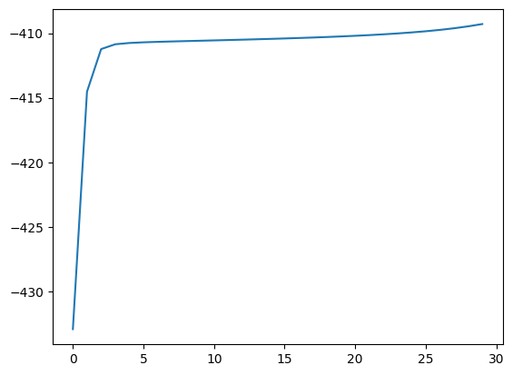
    


Los parámetros óptimos encontrados son los siguientes:


```python
print("ini", initial_state_matrix, "\n trans", transition_matrix, "\n priors", [prior_1, prior_2])
```

    ini [1.00000000e+00 4.19008157e-11] 
     trans [[0.93430848 0.06569152]
     [0.1624426  0.8375574 ]] 
     priors [<tfp.distributions.Normal 'Normal' batch_shape=[] event_shape=[] dtype=float64>, <tfp.distributions.Normal 'Normal' batch_shape=[] event_shape=[] dtype=float64>]
    


```python
hmm = create_HMM(initial_state_matrix,transition_matrix,[prior_1,prior_2],train)
predicted_results  = hmm.posterior_mode(test["Change"].astype(np.float32)).numpy()
print("F1-score:",compute_Fbeta_score(test["NBER"],predicted_results))
print("F2-score:",compute_Fbeta_score(test["NBER"],predicted_results,beta=2))
```

    F1-score: 0.6575342465753425
    F2-score: 0.594059405940594
    

Ahora vamos a hacer un *grid-search*


```python
from google.colab.output import eval_js
eval_js('google.colab.output.setIframeHeight("400")')
#params
initial_state_matrices = [[0.3*i, 1-0.3*i] for i in range(1,3)]
trans_probs = [[[0.3*i, 1-0.3*i],[0.3*j,(1-0.3*j)]] for j in range(1,3) for i in range(1,3)]
means = [-0.5,0.5]
stds = [1]
e_distributions = [[tfd.Normal(loc=i, scale=k),
                  tfd.Normal(loc=j, scale=k)]
                 for i in means for j in means for k in stds]

optimal_params = [[],[],[]]
optimal_log_verosim = 0
i = 0
for i_mat in initial_state_matrices:
  for t_mat in trans_probs:
    for distrib in e_distributions:
      print("iteration:", i, "\nini", i_mat, "\n trans", t_mat, "\n medias:",
      [distrib[0].loc, distrib[1].loc], "\n std:",[distrib[0].scale, distrib[1].scale])
      log_verosim, initial_state_matrix, transition_matrix, distributions = baum_welch_normal(initial_state_matrix,
                                                                                             transition_matrix,
                                                                                             [prior_1, prior_2],
                                                                                              train["Change"],
                                                                                             verbose=False)
      plt.plot(log_verosim)
      plt.show()
      if(log_verosim[-1] > optimal_log_verosim or i==0):
        print("Mejora de verosimilitud:", log_verosim[-1])
        optimal_log_verosim = log_verosim[-1]
        optimal_params[0] = i_mat
        optimal_params[1] = t_mat
        optimal_params[2] = distrib
      i+=1
```

    iteration: 0 
    ini [0.3, 0.7] 
     trans [[0.3, 0.7], [0.3, 0.7]] 
     medias: [<tf.Tensor: shape=(), dtype=float32, numpy=-0.5>, <tf.Tensor: shape=(), dtype=float32, numpy=-0.5>] 
     std: [<tf.Tensor: shape=(), dtype=float32, numpy=1.0>, <tf.Tensor: shape=(), dtype=float32, numpy=1.0>]
    


    
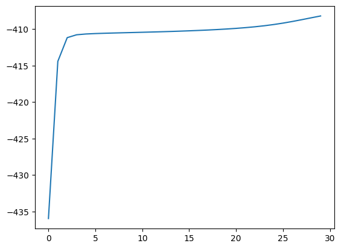
    


    Mejora de verosimilitud: -408.18041229737673
    iteration: 1 
    ini [0.3, 0.7] 
     trans [[0.3, 0.7], [0.3, 0.7]] 
     medias: [<tf.Tensor: shape=(), dtype=float32, numpy=-0.5>, <tf.Tensor: shape=(), dtype=float32, numpy=0.5>] 
     std: [<tf.Tensor: shape=(), dtype=float32, numpy=1.0>, <tf.Tensor: shape=(), dtype=float32, numpy=1.0>]
    


    

    


    Mejora de verosimilitud: -407.99319069509085
    iteration: 2 
    ini [0.3, 0.7] 
     trans [[0.3, 0.7], [0.3, 0.7]] 
     medias: [<tf.Tensor: shape=(), dtype=float32, numpy=0.5>, <tf.Tensor: shape=(), dtype=float32, numpy=-0.5>] 
     std: [<tf.Tensor: shape=(), dtype=float32, numpy=1.0>, <tf.Tensor: shape=(), dtype=float32, numpy=1.0>]
    


    

    


    Mejora de verosimilitud: -407.9777240409028
    iteration: 3 
    ini [0.3, 0.7] 
     trans [[0.3, 0.7], [0.3, 0.7]] 
     medias: [<tf.Tensor: shape=(), dtype=float32, numpy=0.5>, <tf.Tensor: shape=(), dtype=float32, numpy=0.5>] 
     std: [<tf.Tensor: shape=(), dtype=float32, numpy=1.0>, <tf.Tensor: shape=(), dtype=float32, numpy=1.0>]
    


    

    


    Mejora de verosimilitud: -407.9766274101313
    iteration: 4 
    ini [0.3, 0.7] 
     trans [[0.6, 0.4], [0.3, 0.7]] 
     medias: [<tf.Tensor: shape=(), dtype=float32, numpy=-0.5>, <tf.Tensor: shape=(), dtype=float32, numpy=-0.5>] 
     std: [<tf.Tensor: shape=(), dtype=float32, numpy=1.0>, <tf.Tensor: shape=(), dtype=float32, numpy=1.0>]
    


    

    


    Mejora de verosimilitud: -407.97655073637713
    iteration: 5 
    ini [0.3, 0.7] 
     trans [[0.6, 0.4], [0.3, 0.7]] 
     medias: [<tf.Tensor: shape=(), dtype=float32, numpy=-0.5>, <tf.Tensor: shape=(), dtype=float32, numpy=0.5>] 
     std: [<tf.Tensor: shape=(), dtype=float32, numpy=1.0>, <tf.Tensor: shape=(), dtype=float32, numpy=1.0>]
    


    

    


    Mejora de verosimilitud: -407.9765453809078
    iteration: 6 
    ini [0.3, 0.7] 
     trans [[0.6, 0.4], [0.3, 0.7]] 
     medias: [<tf.Tensor: shape=(), dtype=float32, numpy=0.5>, <tf.Tensor: shape=(), dtype=float32, numpy=-0.5>] 
     std: [<tf.Tensor: shape=(), dtype=float32, numpy=1.0>, <tf.Tensor: shape=(), dtype=float32, numpy=1.0>]
    


    

    


    Mejora de verosimilitud: -407.97654500686747
    iteration: 7 
    ini [0.3, 0.7] 
     trans [[0.6, 0.4], [0.3, 0.7]] 
     medias: [<tf.Tensor: shape=(), dtype=float32, numpy=0.5>, <tf.Tensor: shape=(), dtype=float32, numpy=0.5>] 
     std: [<tf.Tensor: shape=(), dtype=float32, numpy=1.0>, <tf.Tensor: shape=(), dtype=float32, numpy=1.0>]
    


    

    


    Mejora de verosimilitud: -407.9765449807436
    iteration: 8 
    ini [0.3, 0.7] 
     trans [[0.3, 0.7], [0.6, 0.4]] 
     medias: [<tf.Tensor: shape=(), dtype=float32, numpy=-0.5>, <tf.Tensor: shape=(), dtype=float32, numpy=-0.5>] 
     std: [<tf.Tensor: shape=(), dtype=float32, numpy=1.0>, <tf.Tensor: shape=(), dtype=float32, numpy=1.0>]
    


    

    


    Mejora de verosimilitud: -407.9765449789193
    iteration: 9 
    ini [0.3, 0.7] 
     trans [[0.3, 0.7], [0.6, 0.4]] 
     medias: [<tf.Tensor: shape=(), dtype=float32, numpy=-0.5>, <tf.Tensor: shape=(), dtype=float32, numpy=0.5>] 
     std: [<tf.Tensor: shape=(), dtype=float32, numpy=1.0>, <tf.Tensor: shape=(), dtype=float32, numpy=1.0>]
    


    

    


    Mejora de verosimilitud: -407.97654497879216
    iteration: 10 
    ini [0.3, 0.7] 
     trans [[0.3, 0.7], [0.6, 0.4]] 
     medias: [<tf.Tensor: shape=(), dtype=float32, numpy=0.5>, <tf.Tensor: shape=(), dtype=float32, numpy=-0.5>] 
     std: [<tf.Tensor: shape=(), dtype=float32, numpy=1.0>, <tf.Tensor: shape=(), dtype=float32, numpy=1.0>]
    


    

    


    Mejora de verosimilitud: -407.9765449787832
    iteration: 11 
    ini [0.3, 0.7] 
     trans [[0.3, 0.7], [0.6, 0.4]] 
     medias: [<tf.Tensor: shape=(), dtype=float32, numpy=0.5>, <tf.Tensor: shape=(), dtype=float32, numpy=0.5>] 
     std: [<tf.Tensor: shape=(), dtype=float32, numpy=1.0>, <tf.Tensor: shape=(), dtype=float32, numpy=1.0>]
    


    

    


    Mejora de verosimilitud: -407.9765449787826
    iteration: 12 
    ini [0.3, 0.7] 
     trans [[0.6, 0.4], [0.6, 0.4]] 
     medias: [<tf.Tensor: shape=(), dtype=float32, numpy=-0.5>, <tf.Tensor: shape=(), dtype=float32, numpy=-0.5>] 
     std: [<tf.Tensor: shape=(), dtype=float32, numpy=1.0>, <tf.Tensor: shape=(), dtype=float32, numpy=1.0>]
    


    

    


    iteration: 13 
    ini [0.3, 0.7] 
     trans [[0.6, 0.4], [0.6, 0.4]] 
     medias: [<tf.Tensor: shape=(), dtype=float32, numpy=-0.5>, <tf.Tensor: shape=(), dtype=float32, numpy=0.5>] 
     std: [<tf.Tensor: shape=(), dtype=float32, numpy=1.0>, <tf.Tensor: shape=(), dtype=float32, numpy=1.0>]
    


    

    


    iteration: 14 
    ini [0.3, 0.7] 
     trans [[0.6, 0.4], [0.6, 0.4]] 
     medias: [<tf.Tensor: shape=(), dtype=float32, numpy=0.5>, <tf.Tensor: shape=(), dtype=float32, numpy=-0.5>] 
     std: [<tf.Tensor: shape=(), dtype=float32, numpy=1.0>, <tf.Tensor: shape=(), dtype=float32, numpy=1.0>]
    


    

    


    iteration: 15 
    ini [0.3, 0.7] 
     trans [[0.6, 0.4], [0.6, 0.4]] 
     medias: [<tf.Tensor: shape=(), dtype=float32, numpy=0.5>, <tf.Tensor: shape=(), dtype=float32, numpy=0.5>] 
     std: [<tf.Tensor: shape=(), dtype=float32, numpy=1.0>, <tf.Tensor: shape=(), dtype=float32, numpy=1.0>]
    


    

    


    iteration: 16 
    ini [0.6, 0.4] 
     trans [[0.3, 0.7], [0.3, 0.7]] 
     medias: [<tf.Tensor: shape=(), dtype=float32, numpy=-0.5>, <tf.Tensor: shape=(), dtype=float32, numpy=-0.5>] 
     std: [<tf.Tensor: shape=(), dtype=float32, numpy=1.0>, <tf.Tensor: shape=(), dtype=float32, numpy=1.0>]
    


    

    


    iteration: 17 
    ini [0.6, 0.4] 
     trans [[0.3, 0.7], [0.3, 0.7]] 
     medias: [<tf.Tensor: shape=(), dtype=float32, numpy=-0.5>, <tf.Tensor: shape=(), dtype=float32, numpy=0.5>] 
     std: [<tf.Tensor: shape=(), dtype=float32, numpy=1.0>, <tf.Tensor: shape=(), dtype=float32, numpy=1.0>]
    


    

    


    iteration: 18 
    ini [0.6, 0.4] 
     trans [[0.3, 0.7], [0.3, 0.7]] 
     medias: [<tf.Tensor: shape=(), dtype=float32, numpy=0.5>, <tf.Tensor: shape=(), dtype=float32, numpy=-0.5>] 
     std: [<tf.Tensor: shape=(), dtype=float32, numpy=1.0>, <tf.Tensor: shape=(), dtype=float32, numpy=1.0>]
    


    

    


    iteration: 19 
    ini [0.6, 0.4] 
     trans [[0.3, 0.7], [0.3, 0.7]] 
     medias: [<tf.Tensor: shape=(), dtype=float32, numpy=0.5>, <tf.Tensor: shape=(), dtype=float32, numpy=0.5>] 
     std: [<tf.Tensor: shape=(), dtype=float32, numpy=1.0>, <tf.Tensor: shape=(), dtype=float32, numpy=1.0>]
    


    

    


    iteration: 20 
    ini [0.6, 0.4] 
     trans [[0.6, 0.4], [0.3, 0.7]] 
     medias: [<tf.Tensor: shape=(), dtype=float32, numpy=-0.5>, <tf.Tensor: shape=(), dtype=float32, numpy=-0.5>] 
     std: [<tf.Tensor: shape=(), dtype=float32, numpy=1.0>, <tf.Tensor: shape=(), dtype=float32, numpy=1.0>]
    


    
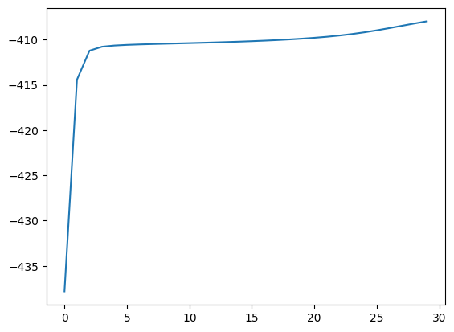
    


    iteration: 21 
    ini [0.6, 0.4] 
     trans [[0.6, 0.4], [0.3, 0.7]] 
     medias: [<tf.Tensor: shape=(), dtype=float32, numpy=-0.5>, <tf.Tensor: shape=(), dtype=float32, numpy=0.5>] 
     std: [<tf.Tensor: shape=(), dtype=float32, numpy=1.0>, <tf.Tensor: shape=(), dtype=float32, numpy=1.0>]
    


    

    


    iteration: 22 
    ini [0.6, 0.4] 
     trans [[0.6, 0.4], [0.3, 0.7]] 
     medias: [<tf.Tensor: shape=(), dtype=float32, numpy=0.5>, <tf.Tensor: shape=(), dtype=float32, numpy=-0.5>] 
     std: [<tf.Tensor: shape=(), dtype=float32, numpy=1.0>, <tf.Tensor: shape=(), dtype=float32, numpy=1.0>]
    


    

    


    iteration: 23 
    ini [0.6, 0.4] 
     trans [[0.6, 0.4], [0.3, 0.7]] 
     medias: [<tf.Tensor: shape=(), dtype=float32, numpy=0.5>, <tf.Tensor: shape=(), dtype=float32, numpy=0.5>] 
     std: [<tf.Tensor: shape=(), dtype=float32, numpy=1.0>, <tf.Tensor: shape=(), dtype=float32, numpy=1.0>]
    


    

    


    iteration: 24 
    ini [0.6, 0.4] 
     trans [[0.3, 0.7], [0.6, 0.4]] 
     medias: [<tf.Tensor: shape=(), dtype=float32, numpy=-0.5>, <tf.Tensor: shape=(), dtype=float32, numpy=-0.5>] 
     std: [<tf.Tensor: shape=(), dtype=float32, numpy=1.0>, <tf.Tensor: shape=(), dtype=float32, numpy=1.0>]
    


    

    


    Mejora de verosimilitud: -407.97654497878256
    iteration: 25 
    ini [0.6, 0.4] 
     trans [[0.3, 0.7], [0.6, 0.4]] 
     medias: [<tf.Tensor: shape=(), dtype=float32, numpy=-0.5>, <tf.Tensor: shape=(), dtype=float32, numpy=0.5>] 
     std: [<tf.Tensor: shape=(), dtype=float32, numpy=1.0>, <tf.Tensor: shape=(), dtype=float32, numpy=1.0>]
    


    

    


    iteration: 26 
    ini [0.6, 0.4] 
     trans [[0.3, 0.7], [0.6, 0.4]] 
     medias: [<tf.Tensor: shape=(), dtype=float32, numpy=0.5>, <tf.Tensor: shape=(), dtype=float32, numpy=-0.5>] 
     std: [<tf.Tensor: shape=(), dtype=float32, numpy=1.0>, <tf.Tensor: shape=(), dtype=float32, numpy=1.0>]
    


    

    


    iteration: 27 
    ini [0.6, 0.4] 
     trans [[0.3, 0.7], [0.6, 0.4]] 
     medias: [<tf.Tensor: shape=(), dtype=float32, numpy=0.5>, <tf.Tensor: shape=(), dtype=float32, numpy=0.5>] 
     std: [<tf.Tensor: shape=(), dtype=float32, numpy=1.0>, <tf.Tensor: shape=(), dtype=float32, numpy=1.0>]
    


    

    


    iteration: 28 
    ini [0.6, 0.4] 
     trans [[0.6, 0.4], [0.6, 0.4]] 
     medias: [<tf.Tensor: shape=(), dtype=float32, numpy=-0.5>, <tf.Tensor: shape=(), dtype=float32, numpy=-0.5>] 
     std: [<tf.Tensor: shape=(), dtype=float32, numpy=1.0>, <tf.Tensor: shape=(), dtype=float32, numpy=1.0>]
    


    

    


    iteration: 29 
    ini [0.6, 0.4] 
     trans [[0.6, 0.4], [0.6, 0.4]] 
     medias: [<tf.Tensor: shape=(), dtype=float32, numpy=-0.5>, <tf.Tensor: shape=(), dtype=float32, numpy=0.5>] 
     std: [<tf.Tensor: shape=(), dtype=float32, numpy=1.0>, <tf.Tensor: shape=(), dtype=float32, numpy=1.0>]
    


    

    


    iteration: 30 
    ini [0.6, 0.4] 
     trans [[0.6, 0.4], [0.6, 0.4]] 
     medias: [<tf.Tensor: shape=(), dtype=float32, numpy=0.5>, <tf.Tensor: shape=(), dtype=float32, numpy=-0.5>] 
     std: [<tf.Tensor: shape=(), dtype=float32, numpy=1.0>, <tf.Tensor: shape=(), dtype=float32, numpy=1.0>]
    


    

    


    Mejora de verosimilitud: -407.9765449787825
    iteration: 31 
    ini [0.6, 0.4] 
     trans [[0.6, 0.4], [0.6, 0.4]] 
     medias: [<tf.Tensor: shape=(), dtype=float32, numpy=0.5>, <tf.Tensor: shape=(), dtype=float32, numpy=0.5>] 
     std: [<tf.Tensor: shape=(), dtype=float32, numpy=1.0>, <tf.Tensor: shape=(), dtype=float32, numpy=1.0>]
    


    

    


```python

i_mat = optimal_params[0]
t_mat = optimal_params[1] 
distrib = optimal_params[2] 

#Parámetros óptimos:
print("optimal_log_verosim:", optimal_log_verosim)
print("\nini", i_mat, "\n trans", t_mat, "\n medias:",
[distrib[0].loc, distrib[1].loc], "\n std:",[distrib[0].scale, distrib[1].scale])

```

    optimal_log_verosim: -407.9765449787825
    
    ini [0.6, 0.4] 
     trans [[0.6, 0.4], [0.6, 0.4]] 
     medias: [<tf.Tensor: shape=(), dtype=float32, numpy=0.5>, <tf.Tensor: shape=(), dtype=float32, numpy=-0.5>] 
     std: [<tf.Tensor: shape=(), dtype=float32, numpy=1.0>, <tf.Tensor: shape=(), dtype=float32, numpy=1.0>]
    


```python
log_verosim, initial_state_matrix, transition_matrix, [prior_1, prior_2] = baum_welch_normal(np.array(i_mat),
                                                                                             np.array(t_mat),
                                                                                             distrib,
                                                                                              train["Change"],
                                                                                             verbose=False)
print("ini", initial_state_matrix, "\n trans", transition_matrix, "\n medias:",
[prior_1.loc, prior_2.loc], "\n std:",[prior_1.scale, prior_2.scale])
hmm = create_HMM(initial_state_matrix,transition_matrix,[prior_1,prior_2],train)
predicted_results  = hmm.posterior_mode(test["Change"].astype(np.float32)).numpy()
print("F1-score:",compute_Fbeta_score(test["NBER"],predicted_results))
print("F2-score:",compute_Fbeta_score(test["NBER"],predicted_results,beta=2))
```

    ini [9.99658982e-01 3.41018482e-04] 
     trans [[0.9389408  0.0610592 ]
     [0.08199763 0.91800237]] 
     medias: [<tf.Tensor: shape=(), dtype=float64, numpy=0.9949049574869265>, <tf.Tensor: shape=(), dtype=float64, numpy=-0.7147465035678843>] 
     std: [<tf.Tensor: shape=(), dtype=float64, numpy=0.8546540709846312>, <tf.Tensor: shape=(), dtype=float64, numpy=1.5801373941236376>]
    F1-score: 0.5882352941176471
    F2-score: 0.5076142131979695
    

### Enfoque log

La diferencia de este algoritmo es que en lugar de usar la variable `scale` para reescalar todos los valores y así evitar el underflow, utilizamos logaritmos.


```python
nber_1 = (train["NBER"] == 1).sum()
nber_0 = (train["NBER"] == 0).sum()

# P(nber = 1 | 0)  y P(nber = 0| 1)
cond_0 = ((train['NBER'] == 1) & (train['NBER'].shift() == 0)).sum()
cond_1 = ((train['NBER'] == 0) & (train['NBER'].shift() == 1)).sum()

#Llamemos Pij a la probabilidad de ir del estado i al j, entonces la matriz de transición es:
p01 = cond_0/nber_0
p00 = 1 - p01
p10 = cond_1/nber_1
p11 = 1 - p10
#Tenemos 2 estados, recesión o no recesión
num_states = 2
batch_size = 1

#Vamos a iniciar con las proporciones de transición acorde a los datos
proporcion_rec = (train["NBER"] == 1).sum() /len(train["NBER"])

# Inicializamos las probabilidades iniciales 
initial_state_matrix = np.array([1 - proporcion_rec, proporcion_rec])
log_start = np.array(np.log([1 - proporcion_rec, proporcion_rec]))
# Creamos la matriz de transición
transition_matrix = np.array([[p00,p01],[p10,p11]])
log_transition = np.log(np.array([[p00,p01],[p10,p11]]))

# Inicializamos las probabilidades de emisión
# Supongamos que los cambios se modelan como una distribución Normal
media_recesion = train.loc[train["NBER"] == 1, "Change"].mean()
media_no_recesion = train.loc[train["NBER"] == 0, "Change"].mean()
std_recesion = train.loc[train["NBER"] == 1, "Change"].std(ddof=0)
std_no_recesion = train.loc[train["NBER"] == 0, "Change"].std(ddof=0)

prior_1= tfd.Normal(loc=media_no_recesion, scale=std_no_recesion)
prior_2= tfd.Normal(loc=media_recesion, scale=std_recesion)
distributions = [prior_1,prior_2]
n_states = 2
observations = train["Change"]
n_obs = len(train["Change"])
hmm=create_HMM(initial_state_matrix,transition_matrix,[prior_1,prior_2],train)
```


```python
#Calculamos forward y backward de otras formas:
def forward_logprobabilities(log_start, log_transition,  distributions, observations):
    # number of states & observations
    n_states = len(log_start)
    n_obs = len(observations)
    log_alpha = np.zeros(( n_states, n_obs))
    scale = np.zeros(n_obs)
    # Calculate the initial forward probabilities
    matrix = [distributions[0].log_prob(observations.iat[0]), distributions[1].log_prob(observations.iat[0])]
    for i,(x, y) in enumerate(zip(log_start, matrix)):
        if x == 0:
            log_alpha[i,0] = 0
        else:
            log_alpha[i, 0] = x + y
    # Compute the forward probabilities recursively
    for i in range(1, n_obs):
      for j in range(n_states):
        log_alpha_aux = []
        for k in range(n_states):
            if log_alpha[k,i-1] == 0:
                log_alpha_aux.append(0)
            else:
                log_alpha_aux.append(log_alpha[k,i-1]+log_transition[k,j])

        log_alpha[j,i] = special.logsumexp(log_alpha_aux) + distributions[j].log_prob(observations.iat[i])

    lik = special.logsumexp(log_alpha[:,-1])
    return log_alpha,lik

def backward_logprobabilities(log_start, log_transition,  distributions, observations):
    # number of states & observations
    n_states = len(log_start)
    n_obs = len(observations)
    log_beta = np.zeros(( n_states, n_obs))
    # Calculate the initial backward probabilities
    log_beta[:,-1] = [0,0]#log([1,1])
    # Compute the backward probabilities recursively
    for i in range(2, n_obs+1):
      for j in range(n_states):
        beta_aux = [log_beta[k, -i+1] + distributions[k].log_prob(observations.iat[-i+1]) + log_transition[j,k] for k in range(n_states)]
        log_beta[j, -i] = special.logsumexp(beta_aux)

    start_state = [log_beta[k, 0] + distributions[k].log_prob(observations.iat[0]) + log_start[k] for k in range(n_states)]
    start_state_val = special.logsumexp(start_state)
    return log_beta, start_state_val
```


```python
alf,lik = forward_logprobabilities(log_start, log_transition,  distributions, train["Change"])
print(alf[:,:5],lik)
beta,lik_b = backward_logprobabilities(log_start, log_transition,  distributions, train["Change"])
print(beta[:,:5],lik_b)
```

    [[ -1.59304634  -3.44686167  -5.17397796  -6.11025966  -7.07162096]
     [ -3.4279793   -4.83343954  -6.35994698  -8.90174156 -10.86466191]] -432.9277007231377
    [[-431.48389535 -429.63243914 -427.85875624 -426.84145472 -425.86911825]
     [-431.47560713 -430.05561302 -428.87328696 -427.76707444 -426.40940046]] -432.9277007231371
    


```python
log_gamma = alf + beta
with np.errstate(under="ignore"):
    a_lse = special.logsumexp(log_gamma, 0, keepdims=True)
    print("lse",a_lse.shape)
log_gamma -= a_lse
gamma = np.exp(log_gamma)
print("posts",gamma[:,:5])
```

    lse (1, 302)
    posts [[0.86136153 0.85933187 0.90029438 0.97627237 0.98704614]
     [0.13863847 0.14066813 0.09970562 0.02372763 0.01295386]]
    


```python
def log_xi_sum(log_forward,log_backward, log_transition, distributions,observations):
  n_states = log_forward.shape[0]
  n_observations = log_forward.shape[1]
  log_prob = special.logsumexp(log_forward[:,-1])#lik
  xi = np.zeros((n_states, n_observations-1, n_states))
  xi_sum = np.zeros((n_states, n_states))
  for t in range(n_observations-1):
      for j in range(n_states):
          for k in range(n_states):
              xi[j,t,k] = (log_forward[j,t]
                           + log_transition[j,k]
                           + distributions[k].log_prob(observations.iat[t+1])
                           + log_backward[k,t+1]
                           -log_prob)
              xi_sum[j,k] = np.logaddexp(xi_sum[j,k],xi[j,t,k])

  return xi,xi_sum
```


```python
log_xi,xi_sum = log_xi_sum(alf,beta, log_transition,  distributions, train["Change"])

```


```python
def fit(log_start, log_transition,  distributions, observations, n_iter = 20,verbose = False):
  n_states = len(log_start)
  n_obs = len(observations)
  log_lik = []
  for iter in range(n_iter):
    #Primero inicializo los valores que vamos a utilizar
    new_start = [0,0]
    new_trans = [[0,0],[0,0]]
    post = np.zeros(n_states)
    nobs = 0#number of samples in data
    obs = np.zeros(n_states)
    obs_sqr = np.zeros(n_states)
    alf,lik = forward_logprobabilities(log_start, log_transition,  distributions, observations)
    log_lik.append(lik)
    beta,lik_b = backward_logprobabilities(log_start, log_transition,  distributions, observations)
    gamma = alf + beta
    with np.errstate(under="ignore"):
        a_lse = special.logsumexp(gamma, 0, keepdims=True)
    gamma -= a_lse
    #Posteriors está al reves que hmmlearn
    posteriors = np.exp(gamma)
    nobs += 1
    new_start += posteriors[:, 0]
    log_xi, xi_sum = log_xi_sum(alf, beta, log_transition, distributions, observations)
    log_gamma0 = special.logsumexp([log_xi[0, t_x, i_x] for t_x in range(n_obs - 1) for i_x in range(n_states)])
    log_gamma1 = special.logsumexp([log_xi[1, t_x, i_x] for t_x in range(n_obs - 1) for i_x in range(n_states)])
    xi00 = special.logsumexp([log_xi[0, x_t, 0] for x_t in range(n_obs - 1)])
    xi01 = special.logsumexp([log_xi[0, x_t, 1] for x_t in range(n_obs - 1)])
    xi10 = special.logsumexp([log_xi[1, x_t, 0] for x_t in range(n_obs - 1)])
    xi11 = special.logsumexp([log_xi[1, x_t, 1] for x_t in range(n_obs - 1)])
    t00 = np.exp(xi00-log_gamma0)
    t01 = np.exp(xi01-log_gamma0)
    t10 = np.exp(xi10-log_gamma1)
    t11 = np.exp(xi11-log_gamma1)
    new_trans = np.array([[t00,t01],[t10,t11]])

    obs_sqr = posteriors @ (observations**2)
    obs = posteriors @ observations
    post = posteriors.sum(axis=1)
    means = obs/post
    covars = np.sqrt(obs_sqr/post - (means**2))#VAR = E[X^2]-E^[X]


    for x in new_start:
        if(x<0.00001):
            x = 1
    log_start = np.log(new_start)#Ten cuidado cuando tiende a 0!
    log_transition = np.log(new_trans)
    prior_1 = tfd.Normal(loc=means[0], scale=covars[0])
    prior_2 = tfd.Normal(loc=means[1], scale=covars[1])
    distributions = [prior_1,prior_2]
    if(verbose == True): print("start:", new_start)
    if(verbose == True): print("transition:", new_trans)
    if(verbose == True): print("means:", means)
    if(verbose == True): print("covars:", covars)
    if(verbose == True): print("log-lik", log_lik[iter])
    diff = 1
    if(iter>0):
        diff = np.abs(log_lik[iter] - log_lik[iter-1])

    if (diff < 0.0001):
        break
  return log_lik, new_start, new_trans, distributions
```


```python
log_verosim, initial_state_matrix, transition_matrix, distributions = fit(np.log(initial_state_matrix), np.log(transition_matrix),distributions,train["Change"])
plt.plot(log_verosim)
plt.show()
```


    
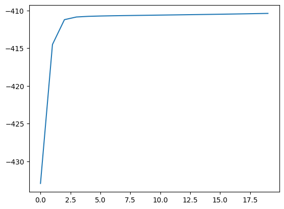
    


```python
print("ini", initial_state_matrix, "\n trans", transition_matrix, "\n distributions", distributions)
```

    ini [9.99999994e-01 6.02804477e-09] 
     trans [[0.94114158 0.05885842]
     [0.26021899 0.73978101]] 
     distributions [<tfp.distributions.Normal 'Normal' batch_shape=[] event_shape=[] dtype=float64>, <tfp.distributions.Normal 'Normal' batch_shape=[] event_shape=[] dtype=float64>]
    


```python
hmm = create_HMM(initial_state_matrix, transition_matrix, distributions,train)
predicted_results = hmm.posterior_mode(train["Change"].astype(np.float32)).numpy()
print("F1-score:", compute_Fbeta_score(train["NBER"], predicted_results))
print("F2-score:", compute_Fbeta_score(train["NBER"], predicted_results, beta=2))
```

    F1-score: 0.5934065934065934
    F2-score: 0.6136363636363636
    


```python
def cond_dist(log_forward, log_backward, log_start, log_trans, distributions,observations):
  n_states = log_forward.shape[0]
  n_observations = log_forward.shape[1]
  log_prob = special.logsumexp(log_forward[:,-1])#lik
  cond = np.zeros((n_states, n_observations))
  matrix = [distributions[0].log_prob(observations.iat[0]), distributions[1].log_prob(observations.iat[0])]
  cond[:,0] = log_start + matrix + log_backward[:,0]
  for t in range(1,n_observations-1):
      for j in range(n_states):
        cond[j,t] = special.logsumexp([log_forward[k,t]\
                    + log_transition[k,j]\
                    + distributions[j].log_prob(observations.iat[t+1])\
                    + log_backward[k,t+1]\
                     for k in range(n_states)])
                    

  return cond
```


```python
conditionals = special.logsumexp(cond_dist(alf,beta,log_start, log_transition,  distributions, train["Change"]),axis = 0)
```

### Decoding


```python
def viterbi(log_start, log_trans, distributions, observations):
    #Aqui guardamos la probabilidad máxima hasta ese punto
    vit = [{}]
    #El camino que hemos llevado hasta la sol
    #En lugar de quedarnos con el puntero, guardamos todo el camino
    path = {}
    n_states = len(log_start)
    n_obs = len(observations)
    # Initialize base cases (t == 0)
    matrix = [distributions[0].log_prob(observations.iat[0]), distributions[1].log_prob(observations.iat[0])]
    for i in range(n_states):
        vit[0][i] = log_start[i] + matrix[i]
        path[i] = [i]

    # Run Viterbi for t > 0
    for t in range(1, n_obs):
        vit.append({})
        updated_path = {}
        for i in range(n_states):
            (prob, state) = max(
                (vit[t - 1][k] + log_trans[k][i] + distributions[i].log_prob(observations.iat[t]), k) for k in range(n_states))
            vit[t][i] = prob
            updated_path[i] = path[state] + [i]
        # Nos quedamos con el mejor camino
        path = updated_path
    (prob, state) = max((vit[0][y], y) for y in range(n_states))
    return (prob, path[state])
```


```python
decode = np.array(viterbi(np.log(initial_state_matrix),
        np.log(transition_matrix),
        [prior_1,prior_2],
        data["Change"])[1])
```


```python
fig = plt.figure(figsize=(10, 4))
ax = fig.add_subplot(1, 1, 1)
most_probable_rates = tf.gather([prior_1.loc, prior_2.loc], decode)
ax.plot(most_probable_rates, c='green', lw=3, label='Estados decodificados')
ax.plot(data["Change"], c='black', alpha=0.3, label='Variación del GDP')
ax.set_ylabel("Change")
ax.set_xlabel("Tiempo")
ax.set_title("Variación de estados respecto del tiempo")
ax.legend(loc=4)
```


    <matplotlib.legend.Legend at 0x7efc3f2300a0>


    
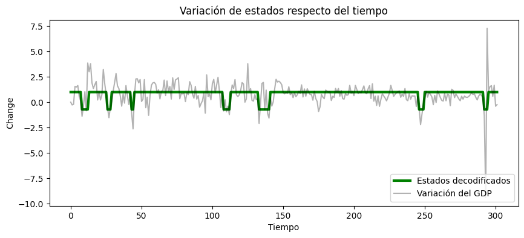
    


Vamos a intentar hacer previsiones (forecasting)


```python
np.matmul(gamma[:,-1],transition_matrix)
```


    array([0.82873485, 0.17126515])


### Autoregressive HMM


```python
train = data
nber_1 = (train["NBER"] == 1).sum()
nber_0 = (train["NBER"] == 0).sum()

# P(nber = 1 | 0)  y P(nber = 0| 1)
cond_0 = ((train['NBER'] == 1) & (train['NBER'].shift() == 0)).sum()
cond_1 = ((train['NBER'] == 0) & (train['NBER'].shift() == 1)).sum()

#Llamemos Pij a la probabilidad de ir del estado i al j, entonces la matriz de transición es:
p01 = cond_0/nber_0
p00 = 1 - p01
p10 = cond_1/nber_1
p11 = 1 - p10
#Tenemos 2 estados, recesión o no recesión
num_states = 2
batch_size = 1

#Vamos a iniciar con las proporciones de transición acorde a los datos
proporcion_rec = (train["NBER"] == 1).sum() /len(train["NBER"])

# Inicializamos las probabilidades iniciales 
initial_state_matrix = np.array([1 - proporcion_rec, proporcion_rec])
# Creamos la matriz de transición
transition_matrix = np.array([[p00,p01],[p10,p11]])

# Inicializamos las probabilidades de emisión
# Supongamos que los cambios se modelan como una distribución Normal
media_recesion = train.loc[train["NBER"] == 1, "Change"].mean()
media_no_recesion = train.loc[train["NBER"] == 0, "Change"].mean()
std_recesion = train.loc[train["NBER"] == 1, "Change"].std(ddof=0)
std_no_recesion = train.loc[train["NBER"] == 0, "Change"].std(ddof=0)

prior_1= tfd.Normal(loc=media_no_recesion, scale=std_no_recesion)
prior_2= tfd.Normal(loc=media_recesion, scale=std_recesion)
n_states = 2
n_obs = len(train["Change"])
observations = train["Change"]
starting_loc =  tf.Variable([media_no_recesion, media_recesion], shape = (2,), dtype=tf.float32, name = "medias")
starting_scale = tf.Variable([ std_no_recesion, std_recesion], shape = (2,), dtype=tf.float32, name = "varianzas")
observation_distribution = tfd.Normal(loc= starting_loc, scale=starting_scale)
#hmm=create_HMM(initial_state_matrix,transition_matrix,[prior_1,prior_2],train)
```


```python
import statsmodels.api as sm
from statsmodels.graphics.tsaplots import plot_acf
import matplotlib.pyplot as plt
```


```python
sm.
```


```python
# Plot autocorrelation
plt.rc("figure", figsize=(5,2))
plot_acf(data["Change"], lags=48)
plt.ylim(0,1)
plt.xlabel('Coeficientes', fontsize=17)
plt.ylabel('Correlacción', fontsize=17)
plt.title('Diagrama de autocorrelación', fontsize=20)
plt.xticks(fontsize=17)
plt.yticks(fontsize=17)
plt.tight_layout()
plt.show()
```


    ---------------------------------------------------------------------------

    NameError                                 Traceback (most recent call last)

    <ipython-input-1-c3f8acf3e3a4> in <cell line: 2>()
          1 # Plot autocorrelation
    ----> 2 plt.rc("figure", figsize=(5,2))
          3 plot_acf(data["Change"], lags=48)
          4 plt.ylim(0,1)
          5 plt.xlabel('Coeficientes', fontsize=17)
    

    NameError: name 'plt' is not defined


### More ARHMM


```python
class ArDensity():
  def __init__(self, observations, K, mu, sigma):
    self.observations = observations
```
